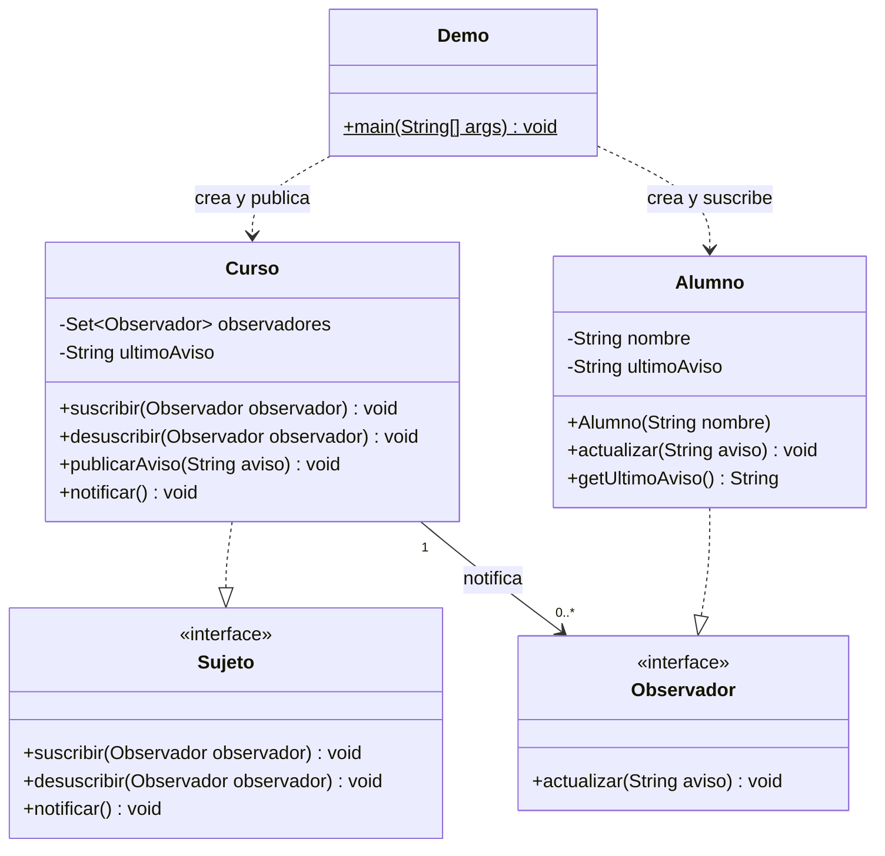
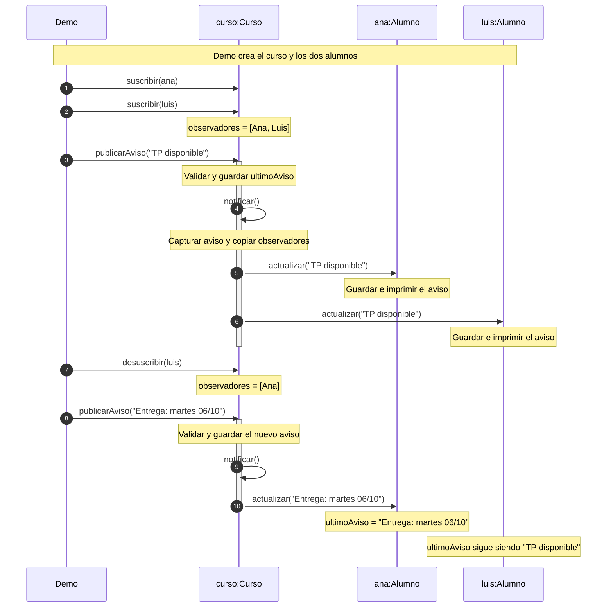
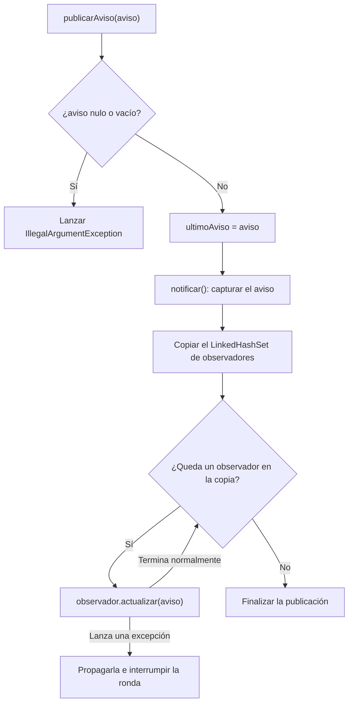

# Observer — diagramas del ejemplo

Código de referencia: rama `Patrones-Completos`, commit `cf8dbfc`, paquete `com.patronesingsoft.behavioral.Observer`. Los diagramas describen ese código; el recorrido de secuencia muestra la parte principal de `Demo`, antes de sus pruebas adicionales.

## Clases y contratos

Realización (`..|>`): una clase implementa una interfaz. Asociación (`-->`): el curso guarda referencias a observadores. Dependencia (`..>`): el cliente crea y usa objetos. No se usa composición: desuscribir no destruye al alumno.

## Secuencia completa de la demo principal

Las llamadas se ejecutan en el mismo hilo. Los retornos se omiten para destacar las entregas. `LinkedHashSet` conserva el orden de suscripción: Ana, luego Luis.

## Flujo de una publicación

El aviso y los destinatarios se capturan para la ronda. Las altas y bajas durante una entrega afectan las rondas siguientes. La excepción de un receptor se propaga: el código no la captura para continuar con los demás.

## Lectura del estado final

| Objeto | Estado | Último aviso |
| --- | --- | --- |
| `curso` | Suscriptos: `[Ana]` | `Entrega: martes 06/10` |
| `ana` | Suscripta | `Entrega: martes 06/10` |
| `luis` | Desuscripto | `TP disponible` |

La presentación utiliza vistas resumidas de estos diagramas. La diapositiva 7 del HTML permite avanzar por las instantáneas de esta ejecución.
