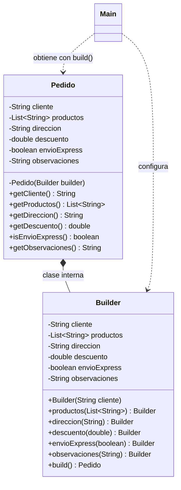

# Builder

**Tipo:** Creacionales. **Ejemplo:** Armado de un `Pedido` con cliente, productos, dirección, descuento, envío exprés y observaciones.

## Problema

Crear un objeto con muchos campos opcionales obliga a constructores largos o a varios constructores sobrecargados (uno por combinación), lo que es propenso a errores y difícil de leer.

## Solución

`Pedido` expone una clase interna `Builder` que permite configurar cada campo con un método encadenable y construir el objeto al final con `build()`. El constructor de `Pedido` es privado, así que solo se puede crear a través del `Builder`.

## Participantes y archivos

| Archivo o participante | Rol |
| --- | --- |
| `Pedido` | producto que se quiere construir |
| `Pedido.Builder` | builder interno (clase estática anidada en `Pedido.java`) |
| `Main` | cliente |

`Pedido.java` contiene al producto y a su `Builder`. `Main.java` organiza el ejemplo.

## Diagrama UML

El diagrama resume las relaciones y operaciones relevantes del código. `Builder` es una clase interna estática de `Pedido`, por eso se modela con composición.





## Consecuencias

- **Ventajas:** Permite construir objetos con campos opcionales de forma legible y encadenada, sin constructores telescópicos.
- **Costos:** Agrega una clase extra por producto y el objeto se configura en varios pasos en vez de uno solo.

## Ejecutar y comprobar

Requiere JDK 17 o superior. Desde la raíz del repo, compilar y ejecutar en PowerShell:

```powershell
$fuentes = Get-ChildItem -Filter '*.java' 'src/main/java/com/patronesingsoft/Patrones_Creacionales/Builder'
javac --release 17 -encoding UTF-8 -d target/builder $fuentes.FullName
java -cp target/builder com.patronesingsoft.Patrones_Creacionales.Builder.Main
```

En el IDE, ejecutar `Main.java` de esta carpeta. Si se compila con Maven (`mvn compile`), ejecutar `java -cp target/classes com.patronesingsoft.Patrones_Creacionales.Builder.Main`.

**Qué se comprueba:** Se arma un `Pedido` para el cliente "Messi" con productos, dirección, descuento, envío exprés y observaciones, y se imprime por consola.

## Guion breve para exponer

1. Presentar el problema del ejemplo.
2. Identificar los participantes en el UML y abrir sus archivos.
3. Ejecutar `Main` y seguir las llamadas relevantes en el código comentado.
4. Explicar esta idea: cada método del `Builder` devuelve el propio `Builder`, lo que permite encadenar la configuración hasta llamar a `build()`.
5. Cerrar con una ventaja y un costo de usar el patrón.

## Referencia conceptual

[Refactoring.Guru — Builder](https://refactoring.guru/es/design-patterns/builder). La explicación y el UML corresponden a la implementación didáctica de este repositorio. No se copian los ejemplos de la fuente.
