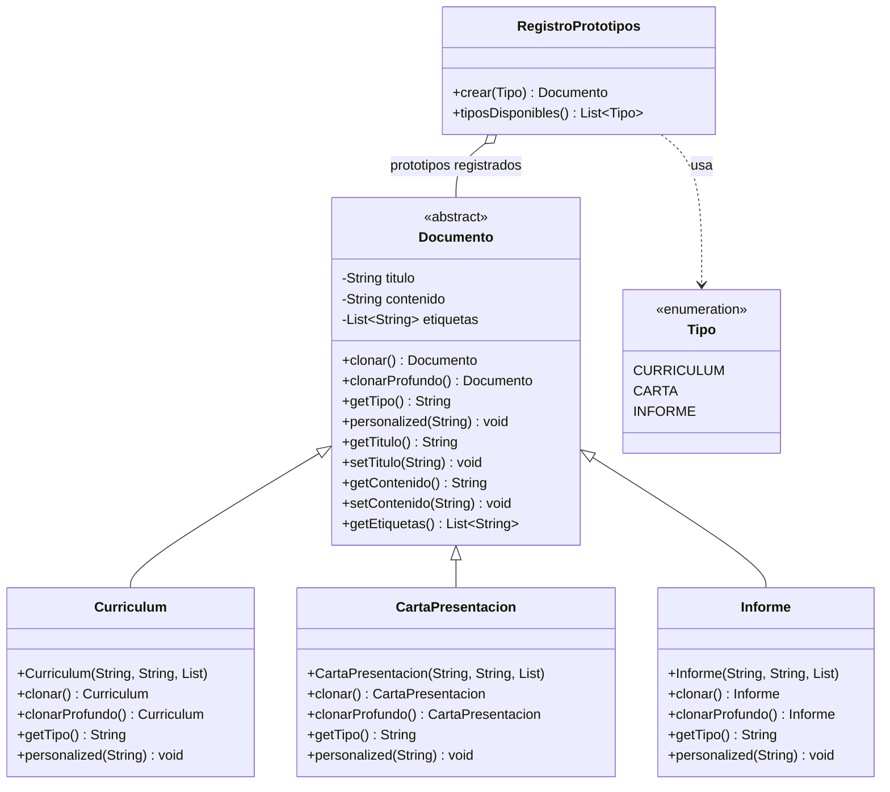

# Patrones de Diseño I – Patrón Prototype (Prototipo)


## 1. Diagrama UML de clases



### Descripción de clases, atributos, métodos y relaciones

| Elemento | Tipo | Rol | Descripción |
|---|---|---|---|
| `Documento` | Clase abstracta | **Prototype** | Define la *operación de clonado* (`clonar`, `clonarProfundo`). Declara el comportamiento común (`getTipo`, `personalized`) y los atributos a copiar (`titulo`, `contenido`, `etiquetas`). Implementa `Cloneable` para poder usar `Object.clone()`. |
| `Curriculum` | Clase | **Concrete Prototype** | Copia concreta de currículum. Sobrescribe `clonar()` para devolver el tipo específico (evita casts). |
| `CartaPresentacion` | Clase | **Concrete Prototype** | Copia concreta de carta de presentación. |
| `Informe` | Clase | **Concrete Prototype** | Copia concreta de informe. |
| `RegistroPrototipos` | Clase | **Prototype Manager** | Guarda un modelo por tipo y entrega copias de él mediante `crear(Tipo)`. Evita que el cliente use `new`. |
| `Tipo` | Enumeración | — | Claves del registro (`CURRICULUM`, `CARTA`, `INFORME`). |

**Relaciones:**

- **Generalización:** `Curriculum`, `CartaPresentacion` e `Informe` heredan de `Documento`. El patrón evita *duplicar código*: todos los prototipos concretos comparten la misma lógica de clonado heredada.
- **Asociación / agregación:** `RegistroPrototipos` mantiene una referencia a un `Documento` por cada `Tipo` (el prototipo base).
- **Dependencia:** `RegistroPrototipos` depende de la enumeración `Tipo`.

---

## 2. Análisis del patrón

### a. Problema

Se necesitan muchos objetos **de la misma clase pero con contenido distinto** (un currículum por postulante, una carta por candidato). La solución ingenua es **reconstruir el objeto desde cero** cada vez, repitiendo todos los valores por defecto:

```java
// Sin Prototype: el cliente repite la estructura interna del documento.
Documento cv = new Curriculum(
        "Curriculum",
        "Formacion academica y experiencia laboral.",
        List.of("cv", "rrhh"));
```

Esa forma tiene tres problemas:

1. **El cliente conoce la estructura interna** del objeto (cuántos campos tiene, cuáles son obligatorios). Agregar un campo obliga a modificar todos los lugares que construyen el objeto.
2. **Se duplican los valores por defecto**: la misma cadena base se escribe una y otra vez.
3. **Coste de construcción**: si crear un objeto es caro (consultar la base de datos, leer un archivo, armar una plantilla), crear cientos de ellos es inviable, aunque solo cambie un dato.

### b. Solución

El patrón **Prototype** delega la creación del objeto **al propio objeto ya existente**. El flujo es:

1. Se crea **una sola vez** el objeto modelo (el *prototipo*).
2. Cada vez que se necesita un documento, se invoca la **operación de clonado** `clonar()` sobre ese modelo, que devuelve una copia.
3. El cliente recibe la copia y la personaliza con `personalized(nombre)`.

Así el código repetido desaparece: el cliente pide "un currículum" y nunca ve los campos internos. Además, como la copia se hace en memoria sin volver a ejecutar la construcción, es la alternativa indicada cuando los objetos son caros de crear o contienen muchos campos opcionales.

En Java la operación de clonado se apoya en `Cloneable` + `Object.clone()`, que hace una **copia superficial**: los campos de tipo primitivo y los `String` (inmutables) se copian por valor, pero los objetos mutables se copia **la referencia**. Por eso la implementación agrega `clonarProfundo()`, que reconstruye la lista `etiquetas` para que el clon sea realmente independiente.

En el ejemplo, `RegistroPrototipos` actúa como *Prototype Manager*: mantiene un prototipo por tipo y `crear(Tipo)` devuelve un clon profundo, de modo que ni siquiera el cliente necesita saber qué clase concreta se está creando.

### c. Consecuencias

**Ventajas**

- **Aísla al cliente de la clase concreta**: no necesita `new`, no conoce los atributos, no hay constructores con listas largas de parámetros.
- **Reduce la duplicación** de código y de valores por defecto; agregar un campo no obliga a tocar al cliente.
- **Más eficiente que crear desde cero** cuando la construcción es costosa (el clonado solo copia memoria).
- **Los clones son independientes** si se usa copia profunda: cada documento puede modificarse sin afectar a los demás.
- Permite trabajar con `Documento` de forma polimórfica (el caso 5 de `Main` trata currículum, carta e informe sin preguntar el tipo).

**Desventajas**

- **La copia superficial es una trampa**: `Object.clone()` copia referencias, así que mutar un atributoCollection del clon **modifica el original** (demostrado en el caso 3 de `Main`). Cada clase debe saber hacer su copia profunda correctamente; si se olvida, aparecen errores difíciles de detectar.
- **No todos los objetos se pueden clonar**: los que contienen recursos no clonables (streams, sockets, hilos) requieren una estrategia adicional.
- El clon y el original **se mantienen independientes en el tiempo**: si el original cambia, los clones existentes no se actualizan (al revés de una referencia compartida).
- La copia profunda **duplica el trabajo**: crear la copia puede costar casi lo mismo que construir un objeto nuevo, en cuyo caso el patrón no aporta ventaja.
- Añade una capa extra (el `registro`) que puede ser innecesaria si solo hay una clase de producto.

**Implicancias**

- La clase prototipo debe implementar la operación de clonado y **declarar** (`Cloneable`), porque `Object.clone()` es `protected`.
- En Java conviene usar un **constructor copia** en lugar de `clone()` cuando se busca claridad e inmutabilidad, aunque el patrón se suela asociar con `Cloneable`.
- Las subclases que agregan referencias mutables **están obligadas** a sobrescribir el clonado (el LSP exige que el tipo devuelto sea covariante: `Curriculum clonar()`).

---

## 3. Implementación

El código está en `src/main/java/com/patronesingsoft/Patrones_Creacionales/Prototype/` y pertenece al paquete `com.patronesingsoft.Patrones_Creacionales.Prototype`. Resumen:

- `Documento` es el prototipo abstracto e implementa `Cloneable`; `clonar()` hace la copia superficial y `clonarProfundo()` re-crea la lista de etiquetas.
- `Curriculum`, `CartaPresentacion` e `Informe` son los prototipos concretos; cada uno personaliza su título y devuelve su propio tipo al clonar.
- `RegistroPrototipos` guarda un modelo por tipo y `crear(Tipo)` devuelve un clon profundo.
- `Main` demuestra cinco escenarios: clonado básico, independence de la copia, el peligro de la copia superficial, creación vía registro y tratamiento polimórfico.

Fragmento clave (Prototype abstracto):

```java
public abstract class Documento implements Cloneable {

    private List<String> etiquetas;

    public Documento clonar() {
        try {
            return (Documento) super.clone();
        } catch (CloneNotSupportedException e) {
            throw new AssertionError("Documento debe implementar Cloneable", e);
        }
    }

    public Documento clonarProfundo() {
        Documento copia = clonar();
        copia.etiquetas = new ArrayList<>(this.etiquetas); // lista nueva: ya no es compartida
        return copia;
    }
}
```

Fragmento clave (Prototype Manager):

```java
public Documento crear(Tipo tipo) {
    Documento prototipo = prototipos.get(tipo);
    if (prototipo == null) {
        throw new IllegalArgumentException("No hay prototipo registrado para: " + tipo);
    }
    return prototipo.clonarProfundo();
}
```

Salida de la ejecución:

```
=== Caso 1: clonar un prototipo base ===
  Original : Curriculum{titulo='Curriculum', contenido='Formacion academica y experiencia laboral.', etiquetas=[cv, rrhh], idObjeto=2060468723, idEtiquetas=622488023}
  Copia    : Curriculum{titulo='Curriculum', contenido='Formacion academica y experiencia laboral.', etiquetas=[cv, rrhh], idObjeto=1984697014, idEtiquetas=622488023}
  --> Son el mismo objeto?     false
  --> Comparten la lista?      true

=== Caso 2: modificar la copia no afecta al original (copia profunda) ===
  Copia profunda inicial : Curriculum{titulo='Curriculum', contenido='Formacion academica y experiencia laboral.', etiquetas=[cv, rrhh], idObjeto=1309552426, idEtiquetas=1943105171}
  Copia modificada        : Curriculum{titulo='Curriculum de Juan Perez', contenido='Actualizado por el_area de RRHH.', etiquetas=[cv, rrhh, urgente], idObjeto=1309552426, idEtiquetas=1943105171}
  Original intacto        : Curriculum{titulo='Curriculum', contenido='Formacion academica y experiencia laboral.', etiquetas=[cv, rrhh], idObjeto=2060468723, idEtiquetas=622488023}

=== Caso 3: el peligro de la copia superficial ===
  Original tras tocar la copia superficial: Curriculum{titulo='Curriculum', contenido='Formacion academica y experiencia laboral.', etiquetas=[cv, rrhh, URGENTE-VERIFICAR], idObjeto=2060468723, idEtiquetas=622488023}
  --> Se modifico el original? true

=== Caso 4: el registro de prototipos crea documentos sin 'new' ===
  Tipos registrados: [CURRICULUM, CARTA, INFORME]
  Nuevo curriculum: Curriculum{titulo='Curriculum de Maria Gomez', contenido='Formacion academica y experiencia laboral.', etiquetas=[cv, rrhh], idObjeto=1442407170, idEtiquetas=1028566121}
  Nueva carta    : CartaPresentacion{titulo='Carta de presentacion de Martin Diaz', contenido='Presentacion personal y solicitud de empleo.', etiquetas=[carta, rrhh], idObjeto=1118140819, idEtiquetas=1975012498}

=== Caso 5: polymorphism: el cliente no conoce la clase concreta ===
  Curriculum{titulo='Curriculum de Equipo de Ventas', contenido='Formacion academica y experiencia laboral.', etiquetas=[cv, rrhh, 2026], idObjeto=1808253012, idEtiquetas=589431969}
  CartaPresentacion{titulo='Carta de presentacion de Equipo de Ventas', contenido='Presentacion personal y solicitud de empleo.', etiquetas=[carta, rrhh, 2026], idObjeto=1252169911, idEtiquetas=2101973421}
  Informe{titulo='Informe de Equipo de Ventas', contenido='Detalle de tareas realizadas en el periodo.', etiquetas=[informe, calidad, 2026], idObjeto=685325104, idEtiquetas=460141958}
```