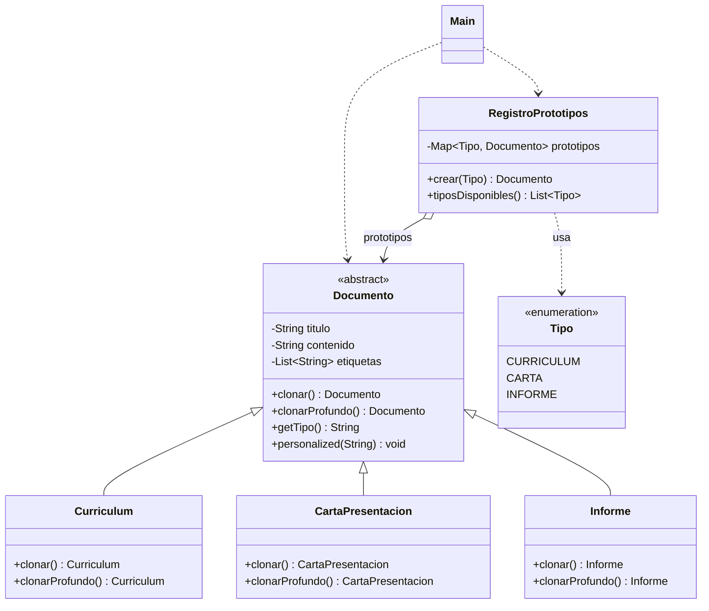

# Prototype

**Tipo:** Creacionales. **Ejemplo:** Documentos (currículum, carta de presentación e informe) que se clonan en vez de construirse desde cero.

El análisis detallado está en `INFORME.md` de esta misma carpeta.

## Problema

Crear muchos documentos del mismo tipo repitiendo valores base es costoso y acopla al cliente con la estructura interna de cada documento.

## Solución

`Documento` define la operación de clonado (`clonar()` superficial y `clonarProfundo()` profunda). Cada subclase se sabe copiar a sí misma y `RegistroPrototipos` guarda un modelo por tipo para entregar copias sin usar `new`.

## Participantes y archivos

| Archivo o participante | Rol |
| --- | --- |
| `Documento` | prototipo abstracto |
| `Curriculum` | prototipo concreto |
| `CartaPresentacion` | prototipo concreto |
| `Informe` | prototipo concreto |
| `RegistroPrototipos` | registro de prototipos (con enum `Tipo`) |
| `Main` | cliente |

Cada clase propia está en un archivo Java con su mismo nombre. `Main.java` organiza el ejemplo y sus comprobaciones; no es un participante esencial del patrón.

## Diagrama UML

El diagrama resume las relaciones y operaciones relevantes del código; omite accesores que no ayudan a explicar el patrón.





## Consecuencias

- **Ventajas:** El cliente crea documentos sin conocer la clase concreta ni repetir valores base; clonar es más barato que reconstruir.
- **Costos:** La copia superficial comparte referencias mutables (la lista `etiquetas`); cada clase debe implementar bien su copia profunda.

## Ejecutar y comprobar

Requiere JDK 17 o superior. Desde la raíz del repo, compilar y ejecutar en PowerShell:

```powershell
$fuentes = Get-ChildItem -Filter '*.java' 'src/main/java/com/patronesingsoft/Patrones_Creacionales/Prototype'
javac --release 17 -encoding UTF-8 -d target/prototype $fuentes.FullName
java -cp target/prototype com.patronesingsoft.Patrones_Creacionales.Prototype.Main
```

En el IDE, ejecutar `Main.java` de esta carpeta. Si se compila con Maven (`mvn compile`), ejecutar `java -cp target/classes com.patronesingsoft.Patrones_Creacionales.Prototype.Main`.

**Qué se comprueba:** Clonado básico, independencia de la copia profunda, peligro de la copia superficial, creación vía registro y tratamiento polimórfico.

## Guion breve para exponer

1. Presentar el problema del ejemplo.
2. Identificar los participantes en el UML y abrir sus archivos.
3. Ejecutar `Main` y seguir las llamadas relevantes en el código comentado.
4. Explicar esta idea: el clon superficial comparte la lista `etiquetas` con el original, mientras que el clon profundo crea una lista nueva. Mostrar el caso 3 del `Main`.
5. Cerrar con una ventaja y un costo de usar el patrón.

## Referencia conceptual

[Refactoring.Guru — Prototype](https://refactoring.guru/es/design-patterns/prototype). La explicación y el UML corresponden a la implementación didáctica de este repositorio. No se copian los ejemplos de la fuente.
