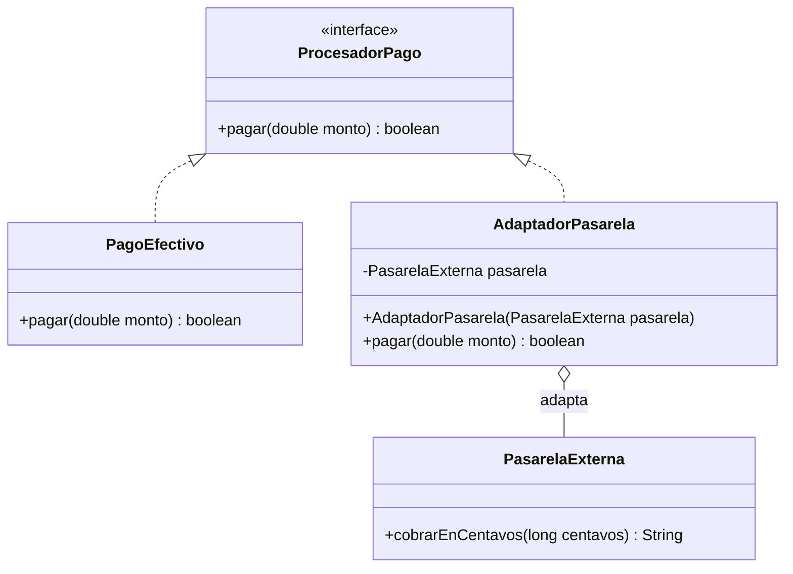

# Patrones de Diseño I – Patrón Adapter (Adaptador)


## 1. Diagrama UML de clases





### Descripción de clases, interfaces, atributos, métodos y relaciones

| Elemento | Tipo | Rol | Descripción |
|---|---|---|---|
| `ProcesadorPago` | Interfaz | **Target** | La interfaz que el sistema ya conoce para cobrar: `pagar(double)`. |
| `PagoEfectivo` | Clase | Medio propio | Ya cumple la interfaz, no necesita adaptador. |
| `PasarelaExterna` | Clase | **Adaptee** | Librería de un tercero (no se puede modificar). Pide centavos (`long`) y devuelve un texto (`"APROBADO"` / `"RECHAZADO"`). |
| `AdaptadorPasarela` | Clase | **Adapter** | Implementa `ProcesadorPago` y por dentro traduce a la API de la pasarela: pesos a centavos y texto a `boolean`. |

**Relaciones:**

- **Realización:** `PagoEfectivo` y `AdaptadorPasarela` implementan `ProcesadorPago`; el cliente los trata por igual (polimorfismo).
- **Asociación (composición) `AdaptadorPasarela → PasarelaExterna`:** el adaptador envuelve a la pasarela (adaptador de objeto) y delega en ella.
- **Dependencia `Main → ProcesadorPago`:** el cliente solo conoce la interfaz objetivo.

---

## 2. Análisis del patrón

### a. Problema

El sistema cobra con `ProcesadorPago.pagar(montoEnPesos)`, pero la pasarela externa habla otro idioma: recibe centavos y devuelve un `String`. Sin adaptador, el cliente tiene que conocer esa API y convertir datos a mano:

```java
String estado = pasarela.cobrarEnCentavos(Math.round(15000.0 * 100));
```

Esto trae tres problemas:

1. **Acoplamiento fuerte:** el código del cliente depende de la clase externa y de sus detalles (centavos, strings de estado).
2. **Lógica de conversión repetida:** cada lugar que cobra repite las mismas conversiones.
3. **No se puede tratar a los medios por igual:** no hay un tipo común, así que no se pueden recorrer en una lista ni agregar un medio nuevo sin tocar al cliente.

Además, la clase externa **no se puede modificar** (es de un tercero), así que no se la puede hacer implementar nuestra interfaz.

### b. Solución

El patrón **Adapter** introduce una clase intermedia:

1. Se define la interfaz objetivo (`ProcesadorPago`) que el cliente ya usa.
2. El **adaptador** (`AdaptadorPasarela`) implementa esa interfaz y **envuelve** al objeto incompatible.
3. Dentro de `pagar(...)` el adaptador **traduce** parámetros y resultado: pesos a centavos y `"APROBADO"` a `boolean`.

El cliente pasa a tratar a todos los medios de pago de la misma forma:

```java
List<ProcesadorPago> medios = List.of(
        new PagoEfectivo(),
        new AdaptadorPasarela(new PasarelaExterna()));

for (ProcesadorPago medio : medios) {
    medio.pagar(15000);
}
```

### c. Consecuencias

**Ventajas**

- **Reutiliza código existente** sin modificarlo: la librería externa queda intacta.
- **Responsabilidad única:** la conversión entre interfaces vive en el adaptador y no se mezcla con la lógica del cliente.
- **Principio Abierto/Cerrado:** sumar un medio nuevo es agregar un adaptador, sin tocar al cliente.
- **Polimorfismo:** el cliente trata igual al medio propio y al externo.
- **Aísla los cambios:** si la API externa cambia, solo se ajusta su adaptador.

**Desventajas**

- **Más clases e indirección:** se agrega una capa por cada sistema adaptado.
- **Puede ocultar limitaciones:** si la API externa hace cosas que la interfaz objetivo no puede expresar, esa funcionalidad queda inaccesible desde el cliente.
- **Si se puede modificar la clase original**, a veces es más simple cambiarla directamente que escribir un adaptador.

**Implicancias**

- Hay dos variantes: **adaptador de objeto** (composición, el que se usa acá) y **adaptador de clase** (herencia múltiple, que Java no permite para clases).
- El adaptador debe traducir también los **errores** (`"RECHAZADO"` se vuelve `false`).
- Se parece al **Decorator** y al **Proxy** en que envuelve un objeto, pero cambia la intención: el Adapter **cambia la interfaz**, el Decorator **mantiene la interfaz y agrega comportamiento**, el Proxy **mantiene la interfaz y controla el acceso**.

---

## 3. Implementación

El código está en `src/main/java/com/patronesingsoft/Patrones_Estructurales/Adapter/` y pertenece al paquete `com.patronesingsoft.Patrones_Estructurales.Adapter`. Resumen:

- `ProcesadorPago` es la interfaz objetivo; `PagoEfectivo` ya la implementa.
- `PasarelaExterna` simula la librería de terceros con interfaz incompatible.
- `AdaptadorPasarela` implementa `ProcesadorPago` y traduce las llamadas.
- `Main` contrasta el cobro **sin** adaptador (caso 1) contra el cobro **con** adaptador (caso 2).

Fragmento clave (Adapter):

```java
public class AdaptadorPasarela implements ProcesadorPago {
    private final PasarelaExterna pasarela;

    public AdaptadorPasarela(PasarelaExterna pasarela) { this.pasarela = pasarela; }

    public boolean pagar(double monto) {
        String estado = pasarela.cobrarEnCentavos(Math.round(monto * 100)); // pesos -> centavos
        return estado.equals("APROBADO");                                   // texto -> boolean
    }
}
```

Fragmento clave (cliente):

```java
List<ProcesadorPago> medios = List.of(
        new PagoEfectivo(),
        new AdaptadorPasarela(new PasarelaExterna()));

for (ProcesadorPago medio : medios) {
    boolean ok = medio.pagar(15000);
    System.out.println("  Resultado: " + (ok ? "OK" : "RECHAZADO"));
}
```
