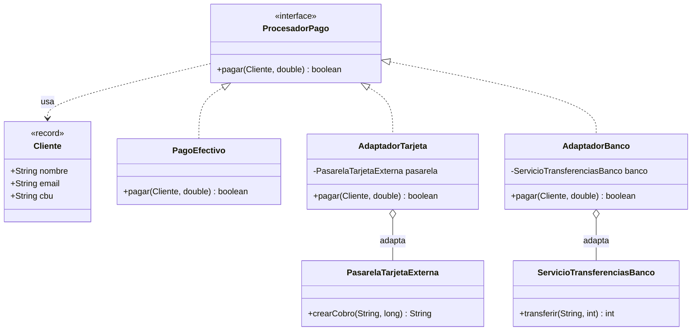

# Patrones de Diseño I – Patrón Adapter (Adaptador)


## 1. Diagrama UML de clases



### Descripción de clases, interfaces, atributos, métodos y relaciones

| Elemento | Tipo | Rol | Descripción |
|---|---|---|---|
| `ProcesadorPago` | Interfaz | **Target** | Interfaz que el sistema ya conoce: `pagar(Cliente, double)` devuelve `true`/`false`. |
| `PagoEfectivo` | Clase | Implementación nativa | Medio de pago propio; ya cumple la interfaz y no necesita adaptador. |
| `PasarelaTarjetaExterna` | Clase | **Adaptee** | Librería de terceros: pide email y monto en **centavos** (`long`) y devuelve un `String` de estado. No se puede modificar. |
| `ServicioTransferenciasBanco` | Clase | **Adaptee** | Servicio del banco: pide CBU y monto en **pesos enteros** (`int`) y devuelve un código numérico (0 = OK). |
| `AdaptadorTarjeta` | Clase | **Adapter** | Implementa `ProcesadorPago` y traduce la llamada a la API de la pasarela. |
| `AdaptadorBanco` | Clase | **Adapter** | Implementa `ProcesadorPago` y traduce la llamada a la API del banco. |
| `Cliente` | Record | DTO | Agrupa los datos que cada sistema necesita (email para la pasarela, CBU para el banco). |

**Relaciones:**

- **Realización `Adaptador → ProcesadorPago`:** el adaptador "se disfraza" de la interfaz que el cliente espera.
- **Agregación `Adaptador → Adaptee`:** el adaptador guarda una referencia a la clase incompatible y le delega el trabajo (**adaptador de objeto**, por composición, no por herencia).
- **Dependencia `ProcesadorPago → Cliente`:** los adaptadores toman de `Cliente` el dato que necesita cada API.
- El Adaptee **no conoce** al adaptador ni a la interfaz objetivo.

---

## 2. Análisis del patrón

### a. Problema

El sistema de la facultad cobra matrículas y quiere sumar dos medios de pago que ya existen como librerías de terceros, con interfaces incompatibles con la nuestra:

- La pasarela de tarjetas usa `crearCobro(email, centavos)` y devuelve un `String`.
- El banco usa `transferir(cbu, pesos)` y devuelve un `int`.

Sin adaptador, el cliente tiene que conocer cada API y convertir datos a mano:

```java
String estado = pasarela.crearCobro(ana.email(), Math.round(MATRICULA * 100));
boolean ok1 = estado.equals("APROBADO");

int codigo = banco.transferir(ana.cbu(), (int) MATRICULA);
boolean ok2 = codigo == 0;
```

Esto trae tres problemas:

1. **Acoplamiento fuerte:** el código del cliente depende de las clases externas y de sus detalles (centavos, strings de estado, códigos).
2. **Lógica de conversión repetida:** cada lugar que cobra repite las mismas conversiones.
3. **No se puede tratar a los medios por igual:** no hay un tipo común, así que no se pueden recorrer en una lista ni agregar un medio nuevo sin tocar al cliente.

Además, las clases externas **no se pueden modificar** (son de un tercero), así que no se las puede hacer implementar nuestra interfaz.

### b. Solución

El patrón **Adapter** introduce una clase intermedia por cada sistema incompatible:

1. Se define la interfaz objetivo (`ProcesadorPago`) que el cliente ya usa.
2. Cada **adaptador** implementa esa interfaz y **envuelve** al objeto incompatible.
3. Dentro de `pagar(...)` el adaptador **traduce** parámetros y resultado: pesos a centavos, `Cliente` a email o CBU, `"APROBADO"`/código a `boolean`.

El cliente pasa a tratar a todos los medios de pago de la misma forma:

```java
List<ProcesadorPago> medios = List.of(
        new PagoEfectivo(),
        new AdaptadorTarjeta(new PasarelaTarjetaExterna()),
        new AdaptadorBanco(new ServicioTransferenciasBanco()));

for (ProcesadorPago medio : medios) {
    medio.pagar(ana, 15000);
}
```

### c. Consecuencias

**Ventajas**

- **Reutiliza código existente** sin modificarlo: las librerías externas quedan intactas.
- **Responsabilidad única:** la conversión entre interfaces vive en el adaptador y no se mezcla con la lógica del cliente.
- **Principio Abierto/Cerrado:** sumar un medio nuevo (por ejemplo billetera virtual) es agregar un adaptador, sin tocar al cliente.
- **Polimorfismo:** el cliente trata igual al medio propio y a los externos.
- **Aísla los cambios:** si la API externa cambia, solo se ajusta su adaptador.

**Desventajas**

- **Más clases e indirección:** se agrega una capa por cada sistema adaptado.
- **Puede ocultar limitaciones:** si la API externa hace cosas que la interfaz objetivo no puede expresar, esa funcionalidad queda inaccesible desde el cliente.
- **Si se puede modificar la clase original**, a veces es más simple cambiarla directamente que escribir un adaptador.
- **Conversiones con pérdida:** por ejemplo, redondear un monto con decimales a pesos enteros para el banco.

**Implicancias**

- Hay dos variantes: **adaptador de objeto** (composición, el que se usa acá) y **adaptador de clase** (herencia múltiple, que Java no permite para clases).
- El adaptador debe traducir también los **errores** (por ejemplo `"RECHAZADO"` o código distinto de 0 se vuelven `false`), como se ve en el Caso 3.
- Se parece al **Decorator** y al **Proxy** en que envuelve un objeto, pero cambia la intención: el Adapter **cambia la interfaz**, el Decorator **mantiene la interfaz y agrega comportamiento**, el Proxy **mantiene la interfaz y controla el acceso**.
- Se combina bien con **Facade** y **Factory** (para elegir qué adaptador instanciar).

---

## 3. Implementación

El código está en `src/main/java/com/patronesingsoft/Patrones_Estructurales/Adapter/` y pertenece al paquete `com.patronesingsoft.Patrones_Estructurales.Adapter`. Resumen:

- `ProcesadorPago` es la interfaz objetivo; `PagoEfectivo` ya la implementa.
- `PasarelaTarjetaExterna` y `ServicioTransferenciasBanco` simulan las librerías de terceros con interfaz incompatible.
- `AdaptadorTarjeta` y `AdaptadorBanco` implementan `ProcesadorPago` y traducen las llamadas.
- `Cliente` es el record con los datos que cada sistema necesita.
- `Main` contrasta el cobro **sin** adaptador (caso 1) contra el cobro **con** adaptadores (casos 2 y 3), incluyendo el caso de error.

Fragmento clave (Adapter):

```java
public class AdaptadorTarjeta implements ProcesadorPago {

    private final PasarelaTarjetaExterna pasarela;

    public AdaptadorTarjeta(PasarelaTarjetaExterna pasarela) {
        this.pasarela = pasarela;
    }

    @Override
    public boolean pagar(Cliente cliente, double monto) {
        long centavos = Math.round(monto * 100);                      // pesos -> centavos
        String estado = pasarela.crearCobro(cliente.email(), centavos);
        return "APROBADO".equals(estado);                             // String -> boolean
    }
}
```

Fragmento clave (cliente):

```java
ProcesadorPago medio = new AdaptadorBanco(new ServicioTransferenciasBanco());
boolean ok = medio.pagar(ana, 15000);
```

Salida de la ejecución:

```
=== Caso 1: cobro SIN adaptador (el cliente conoce cada API) ===
  [PasarelaTarjeta] Cobro creado para ana.lopez@mail.com por 1500000 centavos
  Resultado tarjeta: true
  [Banco] Transferencia de $15000 desde CBU 0170099220000012345678
  Resultado banco: true

=== Caso 2: el mismo cobro CON adaptadores (una sola interfaz) ===
  [Efectivo] Cobro de $15000.0 en caja a Ana Lopez
  Resultado: OK
  [PasarelaTarjeta] Cobro creado para ana.lopez@mail.com por 1500000 centavos
  Resultado: OK
  [Banco] Transferencia de $15000 desde CBU 0170099220000012345678
  Resultado: OK

=== Caso 3: el adaptador tambien traduce el caso de error (monto invalido) ===
  [Efectivo] Cobro de $0.0 en caja a Ana Lopez
  Resultado: RECHAZADO
  [PasarelaTarjeta] Cobro creado para ana.lopez@mail.com por 0 centavos
  Resultado: RECHAZADO
  [Banco] Transferencia de $0 desde CBU 0170099220000012345678
  Resultado: RECHAZADO
```
