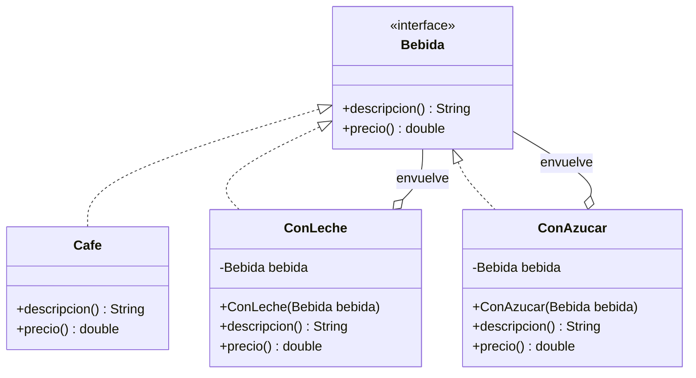

# Patrones de Diseño I – Patrón Decorator (Decorador)


## 1. Diagrama UML de clases





### Descripción de clases, interfaces, atributos, métodos y relaciones

| Elemento | Tipo | Rol | Descripción |
|---|---|---|---|
| `Bebida` | Interfaz | **Component** | Contrato común que cumplen la bebida base y todos los decoradores: `descripcion()` y `precio()`. |
| `Cafe` | Clase | **ConcreteComponent** | La bebida base que se va a decorar (`"Cafe"`, `$1000`). |
| `ConLeche` | Clase | **Decorator** | Envuelve una `Bebida`, delega en ella y le suma leche (`" + leche"`, `+$300`). |
| `ConAzucar` | Clase | **Decorator** | Envuelve una `Bebida`, delega en ella y le suma azúcar (`" + azucar"`, `+$100`). |

**Relaciones:**

- **Realización:** `Cafe`, `ConLeche` y `ConAzucar` implementan `Bebida`; el cliente los trata por igual (transparencia).
- **Asociación (composición) `Decorador → Bebida`:** cada decorador guarda la bebida envuelta y delega en ella antes de agregar su aporte.
- **Apilado en `Main`:** `new ConAzucar(new ConLeche(new Cafe()))` crea la cadena de envoltorios.

---

## 2. Análisis del patrón

### a. Problema

Una bebida admite extras opcionales (leche, azúcar) y sus combinaciones. Con herencia, habría que crear una subclase por cada combinación:

```java
class CafeConLeche extends Cafe { ... }
class CafeConAzucar extends Cafe { ... }
class CafeConLecheYAzucar extends Cafe { ... }
// ... y así sucesivamente
```

Esto trae tres problemas:

1. **Explosión de subclases:** con *n* extras opcionales hay hasta 2^n combinaciones posibles. Cada extra nuevo duplica la cantidad de clases.
2. **Combinaciones fijas en compilación:** la herencia es estática; no se puede cambiar el comportamiento de un objeto mientras el programa corre.
3. **Código duplicado:** la lógica de "sumar leche" se repite en cada subclase que la incluye.

### b. Solución

El patrón **Decorator** reemplaza la herencia por **composición**:

1. Se define una interfaz común (`Bebida`) que cumplen el objeto base y los decoradores.
2. Cada decorador **envuelve** a otra `Bebida`, delega en ella y agrega su propio aporte.
3. El cliente arma la combinación que necesita **apilando** decoradores en tiempo de ejecución:

```java
Bebida bebida = new Cafe();
bebida = new ConLeche(bebida);   // envuelvo el cafe con leche
bebida = new ConAzucar(bebida);  // envuelvo de nuevo con azucar
```

Cada responsabilidad vive en **una sola clase** y se combina como se necesite. Para agregar un extra nuevo (por ejemplo crema) alcanza con **una clase nueva**; no se toca ninguna de las existentes.

### c. Consecuencias

**Ventajas**

- **Más flexible que la herencia:** las responsabilidades se agregan y combinan en tiempo de ejecución, no en compilación.
- **Evita la explosión de subclases:** n decoradores cubren las 2^n combinaciones.
- **Principio Abierto/Cerrado:** se extiende el comportamiento sin modificar `Cafe` ni los demás decoradores.
- **Responsabilidad única:** cada decorador hace una sola cosa.
- **Transparente para el cliente:** trabaja contra `Bebida` sin saber cuántas capas hay.

**Desventajas**

- **Muchas clases pequeñas:** el diseño queda más fragmentado y puede costar de seguir.
- **El orden puede importar:** apilar los mismos decoradores en otro orden puede dar otro resultado según el aporte de cada uno.
- **Difícil de depurar:** con varias capas anidadas cuesta ver cuál decorador hizo qué.
- **Identidad:** el objeto decorado no es el mismo que el original, así que una comparación por `==` o por tipo concreto puede fallar.

**Implicancias**

- El decorador debe respetar el contrato de la interfaz: si cambia la interfaz base, hay que revisar todos los decoradores.
- Es el mismo concepto que usa `java.io`: `new BufferedReader(new InputStreamReader(System.in))` apila decoradores sobre un flujo base.
- Se parece al **Proxy** en la estructura (ambos envuelven un objeto con la misma interfaz) pero la intención es distinta: el Decorator **agrega funcionalidad**, el Proxy **controla el acceso**.

---

## 3. Implementación

El código está en `src/main/java/com/patronesingsoft/Patrones_Estructurales/Decorator/` y pertenece al paquete `com.patronesingsoft.Patrones_Estructurales.Decorator`. Resumen:

- `Bebida` es la interfaz común y `Cafe` el objeto base.
- `ConLeche` y `ConAzucar` son los decoradores concretos: guardan la `Bebida` envuelta y delegan.
- `Main` muestra la bebida base y cómo cambia la descripción y el precio al apilar decoradores.

Fragmento clave (decorador concreto):

```java
public class ConLeche implements Bebida {
    private final Bebida bebida;

    public ConLeche(Bebida bebida) { this.bebida = bebida; }

    public String descripcion() { return bebida.descripcion() + " + leche"; }
    public double precio() { return bebida.precio() + 300; }
}
```

Fragmento clave (cliente):

```java
Bebida bebida = new Cafe();
bebida = new ConLeche(bebida);   // Cafe + leche
bebida = new ConAzucar(bebida);  // Cafe + leche + azucar
System.out.println(bebida.descripcion() + " -> $" + bebida.precio());
```
