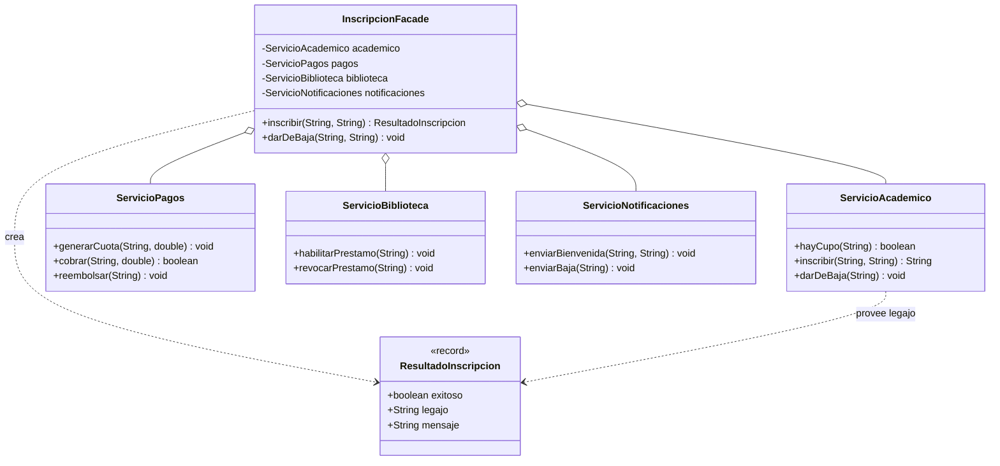

# Patrones de Diseño I – Patrón Facade (Fachada)


## 1. Diagrama UML de clases



### Descripción de clases, interfaces, atributos, métodos y relaciones

| Elemento | Tipo | Rol | Descripción |
|---|---|---|---|
| `InscripcionFacade` | Clase | **Facade** | Interfaz única y simplificada. Conoce y coordina los cuatro subsistemas, en el orden correcto. Expone `inscribir(...)` y `darDeBaja(...)`. |
| `ServicioAcademico` | Clase | **Subsystem** | Verifica cupos, genera legajos y registra la baja. |
| `ServicioPagos` | Clase | **Subsystem** | Genera cuotas, cobra y reembolsa. |
| `ServicioBiblioteca` | Clase | **Subsystem** | Habilita o revoca el préstamo de libros. |
| `ServicioNotificaciones` | Clase | **Subsystem** | Envía los correos (bienvenida, baja). |
| `ResultadoInscripcion` | Record | DTO | Objeto de retorno de la fachada: comunica éxito/fracaso, legajo y mensaje sin exponer las clases internas. |

**Relaciones:**

- **Asociación (composición) `InscripcionFacade → subsistemas`:** la fachada crea y mantiene las cuatro dependencias, y las conoce todas. Los subsistemas **no conocen** a la fachada (relación unidireccional).
- **Dependencia `InscripcionFacade → ResultadoInscripcion`:** la fachada construye el objeto de resultado.
- **Muchas dependencias `Facade → Subsystem`:** es la firma del patrón; en el UML original se dibuja la fachada con líneas hacia cada subsistema.

---

## 2. Análisis del patrón

### a. Problema

Inscribir a un alumno no es una sola operación: requiere verificar el cupo, crear el legajo, generar y cobrar la matrícula, habilitar la biblioteca y enviar el correo, **en ese orden**. Sin fachada, cada cliente que quiera inscribir debe conocer los cuatro subsistemas y la secuencia:

```java
// El cliente está acoplado a todo el subsistema.
if (academico.hayCupo(carrera)) {
    String legajo = academico.inscribir(alumno, carrera);
    pagos.generarCuota(legajo, 15000);
    pagos.cobrar(legajo, 15000);
    biblioteca.habilitarPrestamo(legajo);
    notificaciones.enviarBienvenida(alumno, legajo);
}
```

Esto trae tres problemas:

1. **Acoplamiento fuerte:** el cliente depende de 4 clases concretas. Si un subsistema cambia su firma, hay que modificar a *todos* los clientes.
2. **Lógica duplicada:** la misma secuencia se repite en cada punto que necesita inscribir (web, mostrador, app).
3. **Errores fáciles:** olvidar un paso (por ejemplo, no habilitar la biblioteca) o hacerlos en otro orden produce estados inconsistentes.

### b. Solución

El patrón **Facade** introduce una clase `InscripcionFacade` que:

1. **Envuelve** a los subsistemas y expone un método de alto nivel (`inscribir(alumno, carrera)`).
2. **Coordina** internamente el orden y la sincronización de las llamadas.
3. **Devuelve un resultado simple** (`ResultadoInscripcion`), ocultando las clases internas.

El cliente pasa de conocer 4 clases y su secuencia a conocer **una sola**:

```java
ResultadoInscripcion r = facade.inscribir("Bruno Fernandez", "Sistemas");
```

La fachada **no sustituye** a los subsistemas: encapsula el caso de uso, pero cualquiera que necesite un subsistema puntual puede seguir usándolo directamente. De esta manera se aísla al cliente del acoplamiento y se centraliza la lógica de orquestación en un único lugar.

### c. Consecuencias

**Ventajas**

- **Reduce el acoplamiento:** el cliente solo conoce `InscripcionFacade`; los subsistemas quedan detrás.
- **Simplifica la interfaz:** una llamada en lugar de cinco; ideal para clientes que solo quieren "inscribir" y no los detalles.
- **Centraliza la orquestación y el orden:** la secuencia de pasos y el caso de error (sin cupo) viven en un solo método.
- **Facilita el mantenimiento:** si cambia un subsistema, se ajusta la fachada y no todos los clientes.
- **No impide el acceso directo:** los subsistemas siguen disponibles para casos que requieran control fino (principio de mínima sorpresa).

**Desventajas**

- **Riesgo de fachada "dios"**: si crece con demasiada lógica, se convierte en un objeto todoterreno acoplado a todo el sistema, difícil de mantener.
- **Puede ocultar funcionalidad** que algunos clientes sí necesitan, obligándolos a saltar la fachada.
- **Si el sistema cambia poco**, el patrón agrega una capa de indirección sin aportar mucho.
- **Puede generar cuello de botella organizacional:** la fachada se vuelve un punto que todos deben tocar.

**Implicancias**

- La fachada **no** agrega funcionalidad nueva: solo simplifica el acceso. La lógica de negocio pertenece a los subsistemas.
- Conviene que la fachada dependa de los subsistemas mediante sus métodos públicos y **no** intente acceder a su estado interno.
- Es típicamente un buen **punto de entrada** para una API (por ejemplo, el paquete de servicio de una capa).
- Se combina bien con **Singleton** (una sola fachada) y con **Adapter** (la fachada puede adaptar interfaces dispares).

---

## 3. Implementación

El código está en `src/main/java/com/patronesingsoft/Patrones_Estructurales/Facade/` y pertenece al paquete `com.patronesingsoft.Patrones_Estructurales.Facade`. Resumen:

- Cuatro subsistemas: `ServicioAcademico`, `ServicioPagos`, `ServicioBiblioteca` y `ServicioNotificaciones`.
- `InscripcionFacade` los compone y coordina en `inscribir(...)` y `darDeBaja(...)`.
- `ResultadoInscripcion` es el DTO que devuelve la fachada.
- `Main` contrasta el flujo **sin** fachada (caso 1) contra el flujo **con** fachada (casos 2 a 4), incluyendo el caso de error (sin cupo).

Fragmento clave (Facade):

```java
public ResultadoInscripcion inscribir(String alumno, String carrera) {
    if (!academico.hayCupo(carrera)) {
        return new ResultadoInscripcion(false, null,
                "Sin cupo en " + carrera + ". Inscripcion rechazada.");
    }

    String legajo = academico.inscribir(alumno, carrera);
    pagos.generarCuota(legajo, MATRICULA);
    pagos.cobrar(legajo, MATRICULA);
    biblioteca.habilitarPrestamo(legajo);
    notificaciones.enviarBienvenida(alumno, legajo);

    return new ResultadoInscripcion(true, legajo, "Inscripcion completada correctamente.");
}
```

Fragmento clave (cliente):

```java
InscripcionFacade facade = new InscripcionFacade();
ResultadoInscripcion r = facade.inscribir("Bruno Fernandez", "Sistemas");
```

Salida de la ejecución:

```
=== Caso 1: inscripcion SIN fachada (el cliente conoce todo) ===
  [Academico] Verificando cupo para Sistemas...
  [Academico] Inscrito Ana Lopez en Sistemas -> L-1001
  [Pagos] Cuota generada para L-1001 por $15000.0
  [Pagos] Cobro de $15000.0 registrado para L-1001
  [Biblioteca] Prestamo habilitado para L-1001
  [Notificaciones] Correo de bienvenida a Ana Lopez con legajo L-1001

=== Caso 2: la misma inscripcion CON la fachada ===
== Inscripcion de Bruno Fernandez en Sistemas ==
  [Academico] Verificando cupo para Sistemas...
  [Academico] Inscrito Bruno Fernandez en Sistemas -> L-1001
  [Pagos] Cuota generada para L-1001 por $15000.0
  [Pagos] Cobro de $15000.0 registrado para L-1001
  [Biblioteca] Prestamo habilitado para L-1001
  [Notificaciones] Correo de bienvenida a Bruno Fernandez con legajo L-1001
  Resultado: ResultadoInscripcion[exitoso=true, legajo=L-1001, mensaje=Inscripcion completada correctamente.]

=== Caso 3: la fachada resuelve el caso de error (sin cupo) ===
== Inscripcion de Carla Ruiz en Medicina ==
  [Academico] Verificando cupo para Medicina...
  Resultado: ResultadoInscripcion[exitoso=false, legajo=null, mensaje=Sin cupo en Medicina. Inscripcion rechazada.]
  --> Exitoso? false

=== Caso 4: baja coordinada por la fachada ===
== Baja de Bruno Fernandez (L-1001) ==
  [Academico] Baja academica registrada para L-1001
  [Pagos] Reembolso emitido para L-1001
  [Biblioteca] Prestamo revocado para L-1001
  [Notificaciones] Aviso de baja enviado a Bruno Fernandez
```