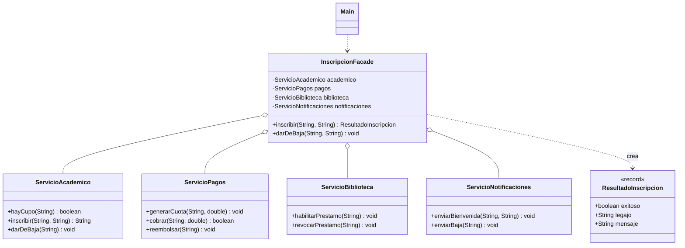

# Facade

**Tipo:** Estructurales. **Ejemplo:** Inscripción de un alumno que coordina cuatro subsistemas (académico, pagos, biblioteca y notificaciones).

El análisis detallado está en `INFORME.md` de esta misma carpeta.

## Problema

Inscribir a un alumno exige llamar a cuatro subsistemas en un orden exacto. Sin fachada, cada cliente debe conocerlos a todos y repetir la secuencia.

## Solución

`InscripcionFacade` expone una sola operación (`inscribir(...)` y `darDeBaja(...)`) y coordina internamente el orden: verificar cupo, inscribir, generar y cobrar cuota, habilitar biblioteca y notificar. Devuelve un `ResultadoInscripcion` simple.

## Participantes y archivos

| Archivo o participante | Rol |
| --- | --- |
| `InscripcionFacade` | fachada |
| `ServicioAcademico` | subsistema |
| `ServicioPagos` | subsistema |
| `ServicioBiblioteca` | subsistema |
| `ServicioNotificaciones` | subsistema |
| `ResultadoInscripcion` | DTO de retorno |
| `Main` | cliente |

Cada clase propia está en un archivo Java con su mismo nombre. `Main.java` organiza el ejemplo y sus comprobaciones; no es un participante esencial del patrón.

## Diagrama UML

El diagrama resume las relaciones y operaciones relevantes del código.





## Consecuencias

- **Ventajas:** El cliente conoce una sola clase; el orden de los pasos y el caso de error (sin cupo) viven en un solo lugar.
- **Costos:** Si la fachada crece sin control se vuelve un objeto acoplado a todo; puede ocultar funciones que algún cliente necesite.

## Ejecutar y comprobar

Requiere JDK 17 o superior. Desde la raíz del repo, compilar y ejecutar en PowerShell:

```powershell
$fuentes = Get-ChildItem -Filter '*.java' 'src/main/java/com/patronesingsoft/Patrones_Estructurales/Facade'
javac --release 17 -encoding UTF-8 -d target/facade $fuentes.FullName
java -cp target/facade com.patronesingsoft.Patrones_Estructurales.Facade.Main
```

En el IDE, ejecutar `Main.java` de esta carpeta. Si se compila con Maven (`mvn compile`), ejecutar `java -cp target/classes com.patronesingsoft.Patrones_Estructurales.Facade.Main`.

**Qué se comprueba:** Flujo sin fachada contra flujo con fachada, caso de error (carrera "Medicina" sin cupo) y baja coordinada.

## Guion breve para exponer

1. Presentar el problema del ejemplo.
2. Identificar los participantes en el UML y abrir sus archivos.
3. Ejecutar `Main` y seguir las llamadas relevantes en el código comentado.
4. Explicar esta idea: el caso 1 obliga al cliente a conocer los 4 subsistemas y su orden; el caso 2 resuelve lo mismo con una sola llamada a la fachada.
5. Cerrar con una ventaja y un costo de usar el patrón.

## Referencia conceptual

[Refactoring.Guru — Facade](https://refactoring.guru/es/design-patterns/facade). La explicación y el UML corresponden a la implementación didáctica de este repositorio. No se copian los ejemplos de la fuente.
