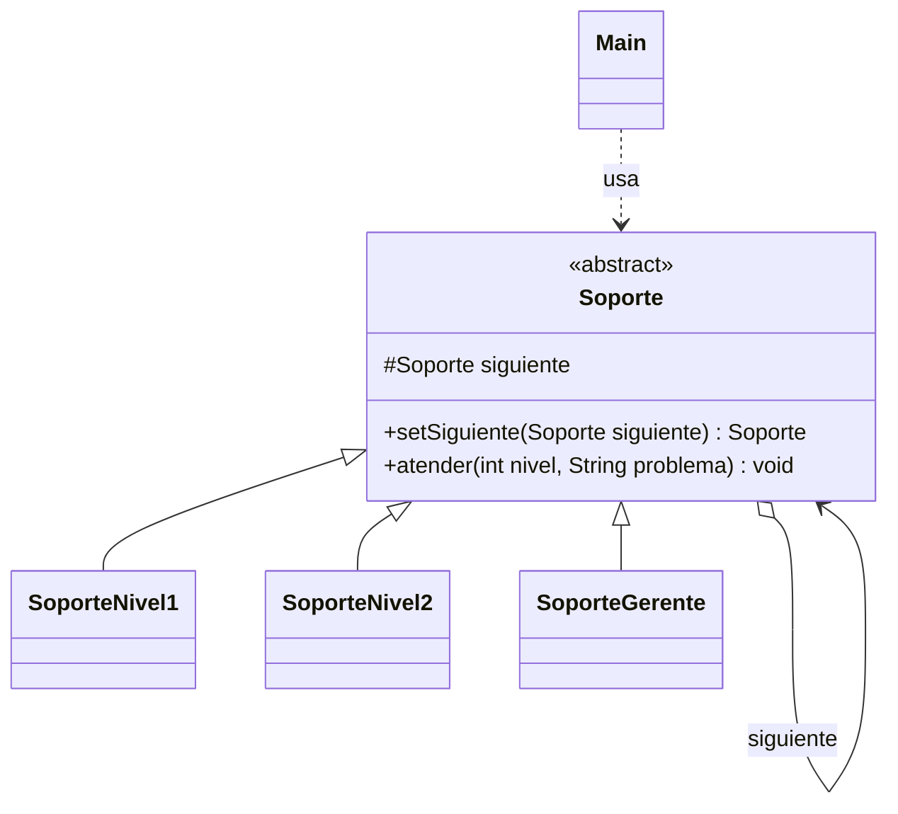

# Patrón Chain of Responsibility — Soporte al cliente por niveles

## 1. Funcionamiento teórico

### Qué es
Es un patrón de comportamiento que permite pasar una petición a través de una **cadena de manejadores**. Cada manejador decide si la procesa o si la pasa al siguiente. El que envía la petición no sabe quién la va a resolver, solo la entrega al primer eslabón.

### Problema que resuelve
Sin este patrón, el código que recibe una petición termina lleno de `if / else if` para decidir quién la atiende:

```java
if (nivel == 1) { ... }
else if (nivel == 2) { ... }
else if (nivel == 3) { ... }
```

Cada vez que se agrega un nivel nuevo hay que modificar ese bloque, y el emisor queda acoplado a todos los receptores.

### Solución
Se crea una cadena de objetos del mismo tipo (`Handler`), cada uno con una referencia al `siguiente`. La petición entra por el primero y va avanzando hasta que alguien la resuelve:

```
Cliente → Nivel 1 → Nivel 2 → Gerente
              ↓          ↓          ↓
           ¿resuelvo? ¿resuelvo? ¿resuelvo?
```

### Estructura del patrón





| Elemento | Rol del patrón | Descripción |
|---|---|---|
| `Soporte` | Handler | Clase abstracta. Guarda la referencia al `siguiente` y declara `atender()`. |
| `SoporteNivel1`, `SoporteNivel2`, `SoporteGerente` | ConcreteHandler | Cada uno resuelve un nivel; si no le corresponde, delega en `siguiente`. |
| `Main` | Client | Arma la cadena y envía las peticiones siempre al primer eslabón. |

### Cuándo usarlo / consecuencias
- **Usarlo cuando:** hay varios objetos que podrían atender una petición, no se quiere acoplar el emisor al receptor, o los niveles pueden cambiar de orden o cantidad.
- **Ventajas:** desacopla emisor y receptor, cumple Abierto/Cerrado (agregar un nivel es agregar una clase), el orden de la cadena se configura en un solo lugar.
- **Desventajas:** una petición puede quedar sin atender si la cadena está mal armada o ningún eslabón la acepta; depurar una cadena larga es más difícil que leer un `if`.

---

## 2. Explicación simple (el código y la vida real)

### La situación real
Un cliente llama al **soporte de una empresa**. No sabe quién lo va a ayudar, solo explica su problema:

- **Nivel 1:** consultas simples → *"Olvidé mi contraseña"*.
- **Nivel 2:** fallas técnicas → *"No funciona el sistema de facturación"*.
- **Gerente:** casos graves → *"Fraude con mi tarjeta"*.

Si el Nivel 1 no puede resolverlo, él mismo deriva la llamada al Nivel 2, y así sucesivamente. El cliente nunca elige a quién llamar: siempre entra por el Nivel 1.

### Cómo lo representa el código
Exactamente lo mismo, con 5 archivos:

| Archivo | Qué representa en la vida real |
|---|---|
| `Soporte.java` | La regla general: "todo empleado de soporte tiene un superior al cual derivar". Guarda el `siguiente` y el método `atender()`. |
| `SoporteNivel1.java` | El empleado de mesa de ayuda. Solo resuelve `nivel == 1`; si no, dice *"pasa al Nivel 2..."* y deriva. |
| `SoporteNivel2.java` | El técnico especializado. Solo resuelve `nivel == 2`; si no, deriva al Gerente. |
| `SoporteGerente.java` | El último eslabón. Resuelve `nivel == 3`. Si llega algo que nadie atiende, informa que no se pudo resolver. |
| `Main.java` | El cliente. Arma la cadena una sola vez y después solo llama al Nivel 1. |

La clave está en `Main`: la cadena se arma una vez y el cliente queda desacoplado:

```java
// Armar la cadena: Nivel 1 -> Nivel 2 -> Gerente
nivel1.setSiguiente(nivel2).setSiguiente(gerente);

// El cliente siempre habla con el primer eslabón
nivel1.atender(1, "Olvidé mi contraseña");
nivel1.atender(2, "No funciona el sistema de facturación");
nivel1.atender(3, "Fraude con mi tarjeta de crédito");
```

Y cada eslabón hace lo mismo: "¿es mi nivel? lo resuelvo; si no, lo paso":

```java
// Ejemplo: SoporteNivel1
if (nivel == 1) {
    System.out.println("Nivel 1 resolvió: " + problema);
} else if (siguiente != null) {
    System.out.println("Nivel 1 no puede resolverlo, pasa al Nivel 2...");
    siguiente.atender(nivel, problema);
}
```

### Salida al ejecutar `Main`

```
--- Caso 1: consulta simple (nivel 1) ---
Nivel 1 resolvió: Olvidé mi contraseña

--- Caso 2: falla técnica (nivel 2) ---
Nivel 1 no puede resolverlo, pasa al Nivel 2...
Nivel 2 resolvió: No funciona el sistema de facturación

--- Caso 3: reclamo grave (nivel 3) ---
Nivel 1 no puede resolverlo, pasa al Nivel 2...
Nivel 2 no puede resolverlo, pasa al Gerente...
Gerente resolvió: Fraude con mi tarjeta de crédito
```

Eso demuestra el patrón: el mismo método `atender()` produce resultados distintos según hasta dónde viaje la petición por la cadena.
