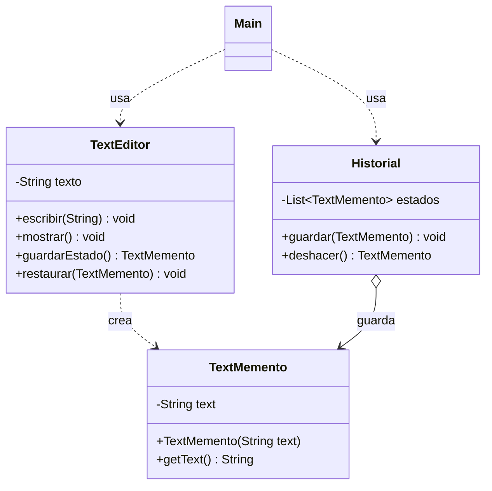

# Memento

**Tipo:** Conductuales. **Ejemplo:** Editor de texto con deshacer.

La guía paso a paso está en `GUIA_MEMENTO.md` de esta misma carpeta.

## Problema

Guardar estados anteriores de un objeto con getters/setters públicos rompe el encapsulamiento y mezcla la lógica del historial con la del negocio.

## Solución

`TextEditor` (originador) crea fotos inmutables de sí mismo (`TextMemento`) y sabe restaurarse desde una foto. `Historial` (cuidador) apila las fotos y las devuelve al pedir deshacer, sin mirar ni modificar su contenido.

## Participantes y archivos

| Archivo o participante | Rol |
| --- | --- |
| `TextEditor` | originador (tiene el estado) |
| `TextMemento` | memento (foto inmutable) |
| `Historial` | cuidador (pila de fotos) |
| `Main` | cliente |

Cada clase propia está en un archivo Java con su mismo nombre. `Main.java` organiza el ejemplo; no es un participante esencial del patrón.

## Diagrama UML

El diagrama resume las relaciones y operaciones relevantes del código.





## Consecuencias

- **Ventajas:** Permite deshacer sin exponer el estado interno; el historial queda separado del negocio.
- **Costos:** Guardar muchas fotos consume memoria y el cuidador debe gestionar la pila (qué pasa si está vacía).

## Ejecutar y comprobar

Requiere JDK 17 o superior. Desde la raíz del repo, compilar y ejecutar en PowerShell:

```powershell
$fuentes = Get-ChildItem -Filter '*.java' 'src/main/java/com/patronesingsoft/Patrones_de_Comportamiento/Memento'
javac --release 17 -encoding UTF-8 -d target/memento $fuentes.FullName
java -cp target/memento com.patronesingsoft.Patrones_de_Comportamiento.Memento.Main
```

En el IDE, ejecutar `Main.java` de esta carpeta. Si se compila con Maven (`mvn compile`), ejecutar `java -cp target/classes com.patronesingsoft.Patrones_de_Comportamiento.Memento.Main`.

**Qué se comprueba:** Se escriben tres cambios (guardando los dos primeros) y dos deshacer restauran los estados anteriores en orden.

## Guion breve para exponer

1. Presentar el problema del ejemplo.
2. Identificar los participantes en el UML y abrir sus archivos.
3. Ejecutar `Main` y seguir las llamadas relevantes en el código comentado.
4. Explicar esta idea: el tercer cambio no se guarda (es el cambio riesgoso) y el primer deshacer lo elimina; `Historial` nunca interpreta el texto, solo apila y desapila.
5. Cerrar con una ventaja y un costo de usar el patrón.

## Referencia conceptual

[Refactoring.Guru — Memento](https://refactoring.guru/es/design-patterns/memento). La explicación y el UML corresponden a la implementación didáctica de este repositorio. No se copian los ejemplos de la fuente.
