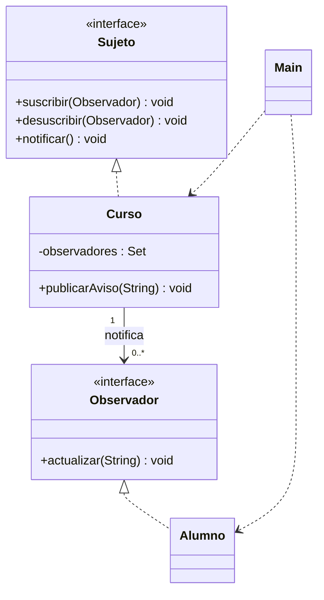

# Observer

**Tipo:** Conductuales. **Ejemplo:** Avisos de un curso a sus alumnos.

## Problema

Un curso debe avisar a un conjunto cambiante de interesados sin depender de clases concretas ni conocer de antemano su cantidad.

## Solución

Curso registra Observador y los notifica al publicar un aviso. Alumno implementa actualizar(); el cliente puede suscribir y dar de baja receptores.

## Participantes y archivos

| Archivo o participante | Rol |
| --- | --- |
| `Sujeto` | contrato de suscripción |
| `Curso` | sujeto concreto |
| `Observador` | contrato de observador |
| `Alumno` | observador concreto |
| `Main` | cliente |

Cada clase o interfaz propia está en un archivo Java con su mismo nombre. `Main.java` organiza el ejemplo y sus comprobaciones; no es un participante esencial del patrón. Los contratos de la biblioteca estándar no se duplican.

## Diagrama UML

El diagrama resume las relaciones y operaciones relevantes del código; omite accesores que no ayudan a explicar el patrón.





## Consecuencias

- **Ventajas:** Permite agregar receptores sin cambiar el sujeto y vincularlos dinámicamente.
- **Costos:** Las suscripciones necesitan gestión; las notificaciones pueden provocar cascadas y un receptor que falla puede afectar la entrega.

## Ejecutar y comprobar

Requiere JDK 17 o superior. Desde la raíz del repo, compilar y ejecutar en PowerShell:

```powershell
$fuentes = Get-ChildItem -Filter '*.java' 'src/main/java/com/patronesingsoft/Patrones_de_Comportamiento/Observer'
javac --release 17 -encoding UTF-8 -d target/observer $fuentes.FullName
java -ea -cp target/observer com.patronesingsoft.Patrones_de_Comportamiento.Observer.Main
```

En el IDE, ejecutar `Main.java` de esta carpeta con la opción de VM `-ea`. Si se compila con Maven (`mvn compile`), ejecutar `java -ea -cp target/classes com.patronesingsoft.Patrones_de_Comportamiento.Observer.Main`.

**Qué se comprueba:** Entrega, baja, ausencia de duplicados, baja durante notificación y rechazo de aviso vacío.

La opción `-ea` habilita las aserciones. Si una condición falla, Java lanza `AssertionError` y la ejecución termina con error. Las validaciones de entradas del ejemplo funcionan también sin `-ea`.

## Guion breve para exponer

1. Presentar el problema del ejemplo.
2. Identificar los participantes en el UML y abrir sus archivos.
3. Ejecutar `Main` y seguir las llamadas relevantes en el código comentado.
4. Explicar esta idea: Publicar un aviso dispara actualizar() en cada suscripto. Mostrar que Luis deja de recibir después de la baja.
5. Cerrar con una ventaja y un costo de usar el patrón.

## Alcance del ejemplo

Un hilo y notificación síncrona. Una excepción de un observador interrumpe la ronda. Altas y bajas durante la ronda afectan las rondas siguientes.

## Referencia conceptual

[Refactoring.Guru — Observer](https://refactoring.guru/es/design-patterns/observer). La explicación y el UML corresponden a la implementación didáctica de este repositorio. No se copian los ejemplos de la fuente.
