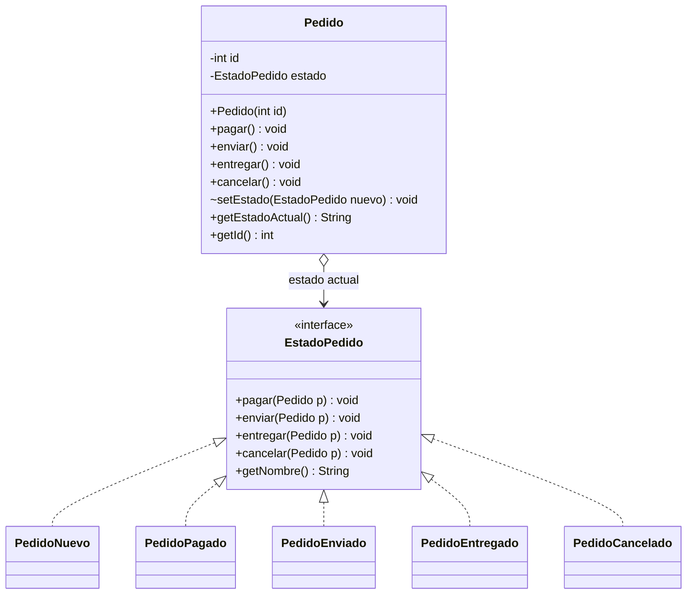
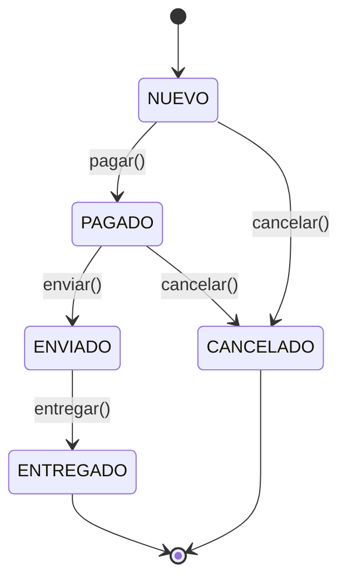

# Patrones de Diseño I – Patrón State


## 1. Diagrama UML de clases



### Diagrama de transiciones de estado



### Descripción de clases, interfaces, atributos, métodos y relaciones

| Elemento | Tipo | Rol | Descripción |
|---|---|---|---|
| `Pedido` | Clase | Context | Representa el pedido. Mantiene una referencia al estado actual (`estado`) y delega en él cada operación. Expone `pagar()`, `enviar()`, `entregar()`, `cancelar()`. `setEstado()` (visibilidad de paquete) lo usan los estados para realizar la transición. |
| `EstadoPedido` | Interfaz | State | Declara las operaciones que dependen del estado: `pagar`, `enviar`, `entregar`, `cancelar` (reciben el `Pedido` como contexto) y `getNombre`. |
| `PedidoNuevo` | Clase | ConcreteState | Estado inicial. Permite pagar (→ `PAGADO`) y cancelar (→ `CANCELADO`). Enviar y entregar son inválidos. |
| `PedidoPagado` | Clase | ConcreteState | Permite enviar (→ `ENVIADO`) y cancelar (→ `CANCELADO`). |
| `PedidoEnviado` | Clase | ConcreteState | Solo permite entregar (→ `ENTREGADO`). Ya no se puede cancelar. |
| `PedidoEntregado` | Clase | ConcreteState | Estado final. Toda operación es inválida. |
| `PedidoCancelado` | Clase | ConcreteState | Estado final. Toda operación es inválida. |

**Relaciones:**

- **Asociación (agregación) `Pedido → EstadoPedido`:** el pedido tiene exactamente un estado en cada momento y lo reemplaza al cambiar de estado.
- **Realización (implementación):** las cinco clases concretas (`PedidoNuevo`, `PedidoPagado`, `PedidoEnviado`, `PedidoEntregado`, `PedidoCancelado`) implementan `EstadoPedido`.
- **Dependencia (estados concretos → `Pedido`):** cada estado recibe el contexto como parámetro para poder cambiarle el estado.

---

## 2. Análisis del patrón

### a. Problema

Un objeto tiene un comportamiento que **cambia según su estado interno** y la cantidad de estados y reglas de transición es considerable. La solución ingenua es poner en cada método de la clase un bloque `if`/`switch` que pregunte por el estado actual:

```java
public void enviar() {
    if (estado == NUEVO)          throw ...;
    else if (estado == PAGADO)    estado = ENVIADO;
    else if (estado == ENVIADO)   throw ...;
    // ...
}
```

Esto genera código con condicionales repetidos en todos los métodos, difícil de leer, de mantener y de extender: agregar un estado nuevo (por ejemplo `DEVUELTO`) obliga a tocar todos los métodos de la clase y viola el principio abierto/cerrado.

### b. Solución

El patrón **State** extrae cada estado a su propia clase, todas bajo una interfaz común (`EstadoPedido`). El contexto (`Pedido`) guarda una referencia al estado actual y **delega** en él cada operación. Cada estado concreto:

1. implementa el comportamiento válido para ese estado, y
2. decide la **transición**, reemplazando el estado del contexto (`pedido.setEstado(new PedidoPagado())`).

Así, `Pedido` no tiene condicionales sobre el estado; el comportamiento "cambia" porque cambia el objeto al que se delega (polimorfismo). Las reglas de negocio quedan localizadas: por ejemplo, la regla "un pedido enviado no se puede cancelar" vive únicamente en `PedidoEnviado`.

### c. Consecuencias

**Ventajas**

- Elimina los condicionales extensos sobre el estado; el código es más claro.
- Cumple **Single Responsibility** (cada clase maneja un único estado) y **Open/Closed** (agregar un estado es agregar una clase).
- Las transiciones son explícitas y están ubicadas en un solo lugar por estado.
- Los estados pueden probarse de forma aislada.

**Desventajas**

- Aumenta la cantidad de clases (una por estado), lo que es excesivo si hay pocos estados o rara vez cambian.
- Los estados concretos conocen a sus sucesores (acoplamiento entre estados), así que agregar un estado intermedio puede obligar a modificar estados existentes.
- Si muchos estados comparten comportamiento, puede aparecer código repetido (se mitiga con una clase base abstracta).
- Hay cierto costo por crear objetos de estado en cada transición (se puede evitar haciendo los estados *singleton* / sin atributos propios).

**Implicancias**

- El contexto debe exponer un mecanismo para cambiar de estado (`setEstado`) a los estados concretos.
- Conviene decidir qué hacer ante operaciones inválidas; aquí se lanza `IllegalStateException`.
- Es parecido a **Strategy**, pero en State las clases conocen y provocan las transiciones entre sí; en Strategy el cliente elige la estrategia y las estrategias no se conocen.

---

## 3. Implementación

El código fuente está en `src/main/java/com/patronesingsoft/Patrones_de_Comportamiento/State/` y sus clases pertenecen al paquete `com.patronesingsoft.Patrones_de_Comportamiento.State`. Resumen del funcionamiento:

- `Pedido` arranca en `PedidoNuevo`.
- Al llamar `pedido.pagar()`, el contexto ejecuta `estado.pagar(this)`. Si el estado actual lo permite, llama a `setEstado(...)` con el nuevo estado; si no, lanza `IllegalStateException`.
- `Main` (propio del patrón) demuestra tres escenarios: flujo normal (`NUEVO → PAGADO → ENVIADO → ENTREGADO`), cancelación antes del envío y operaciones inválidas.

Fragmento clave (Context):

```java
public class Pedido {
    private final int id;
    private EstadoPedido estado;

    public Pedido(int id) {
        this.id = id;
        this.estado = new PedidoNuevo();
    }

    public void pagar()    { estado.pagar(this); }
    public void enviar()   { estado.enviar(this); }
    public void entregar() { estado.entregar(this); }
    public void cancelar() { estado.cancelar(this); }

    void setEstado(EstadoPedido nuevo) {
        System.out.println("  Pedido #" + id + ": " + estado.getNombre() + " -> " + nuevo.getNombre());
        this.estado = nuevo;
    }
}
```

Fragmento clave (ConcreteState):

```java
public class PedidoPagado implements EstadoPedido {
    @Override public void enviar(Pedido p)   { p.setEstado(new PedidoEnviado()); }
    @Override public void cancelar(Pedido p) { p.setEstado(new PedidoCancelado()); }
    @Override public void entregar(Pedido p) {
        throw new IllegalStateException("El pedido todavía no fue enviado.");
    }
    // ...
}
```

Salida de la ejecución:

```
=== Caso 1: flujo normal ===
  Pedido #1: NUEVO -> PAGADO
  Pedido #1: PAGADO -> ENVIADO
  Pedido #1: ENVIADO -> ENTREGADO

=== Caso 2: cancelación antes del envío ===
  Pedido #2: NUEVO -> PAGADO
  Pedido #2: PAGADO -> CANCELADO

=== Caso 3: transiciones inválidas ===
  [Error] Intento de enviar sin pagar: No se puede enviar un pedido sin pagar.
  Pedido #3: NUEVO -> PAGADO
  Pedido #3: PAGADO -> ENVIADO
  [Error] Intento de cancelar un pedido enviado: No se puede cancelar un pedido ya enviado.
  Pedido #3: ENVIADO -> ENTREGADO
  [Error] Intento de pagar un pedido entregado: El pedido ya fue entregado.

Estado final del pedido #3: ENTREGADO
```

