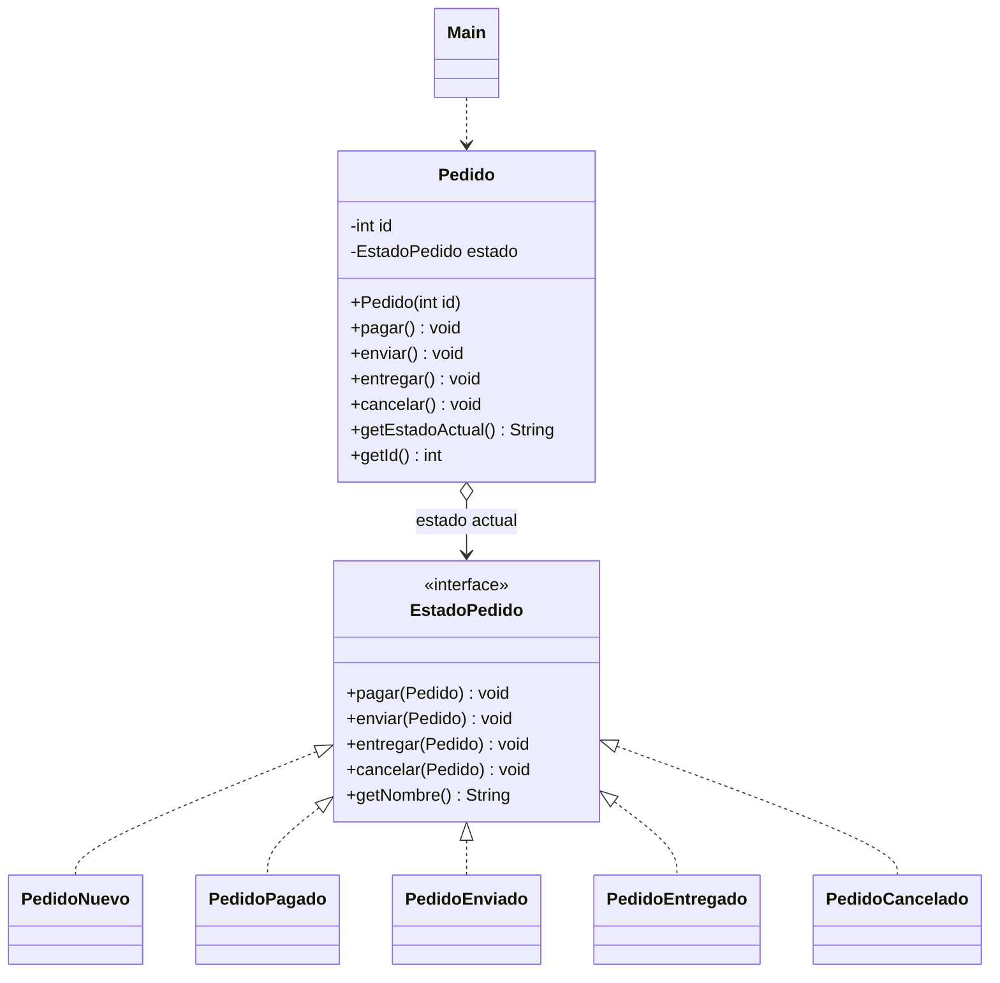

# State

**Tipo:** Conductuales. **Ejemplo:** Pedido que cambia de comportamiento según su estado (nuevo, pagado, enviado, entregado, cancelado).

El análisis detallado está en `INFORME.md` de esta misma carpeta.

## Problema

Un pedido se comporta distinto según su estado y las reglas de transición son varias. Resolverlo con `if / switch` en cada método genera condicionales repetidos y agregar un estado obliga a tocar toda la clase.

## Solución

Cada estado es una clase que implementa `EstadoPedido`. `Pedido` (contexto) guarda el estado actual y delega en él cada operación; cada estado decide si la operación es válida y a qué estado se pasa con `setEstado(...)`.

## Participantes y archivos

| Archivo o participante | Rol |
| --- | --- |
| `Pedido` | contexto |
| `EstadoPedido` | contrato de estado |
| `PedidoNuevo` | estado concreto |
| `PedidoPagado` | estado concreto |
| `PedidoEnviado` | estado concreto |
| `PedidoEntregado` | estado concreto (final) |
| `PedidoCancelado` | estado concreto (final) |
| `Main` | cliente |

Cada clase o interfaz propia está en un archivo Java con su mismo nombre. `Main.java` organiza el ejemplo y sus comprobaciones; no es un participante esencial del patrón.

## Diagrama UML

El diagrama resume las relaciones y operaciones relevantes del código.





Transiciones válidas: `NUEVO → PAGADO → ENVIADO → ENTREGADO`, con `NUEVO → CANCELADO` y `PAGADO → CANCELADO` como salidas alternativas.

## Consecuencias

- **Ventajas:** Elimina los condicionales sobre el estado; agregar un estado es agregar una clase y cada regla vive en un solo lugar.
- **Costos:** Aumenta la cantidad de clases y los estados conocen a sus sucesores, así que agregar un estado intermedio puede obligar a modificar estados existentes.

## Ejecutar y comprobar

Requiere JDK 17 o superior. Desde la raíz del repo, compilar y ejecutar en PowerShell:

```powershell
$fuentes = Get-ChildItem -Filter '*.java' 'src/main/java/com/patronesingsoft/Patrones_de_Comportamiento/State'
javac --release 17 -encoding UTF-8 -d target/state $fuentes.FullName
java -cp target/state com.patronesingsoft.Patrones_de_Comportamiento.State.Main
```

En el IDE, ejecutar `Main.java` de esta carpeta. Si se compila con Maven (`mvn compile`), ejecutar `java -cp target/classes com.patronesingsoft.Patrones_de_Comportamiento.State.Main`.

**Qué se comprueba:** Flujo normal hasta entrega, cancelación antes del envío y operaciones inválidas (enviar sin pagar, cancelar un pedido enviado, pagar un pedido entregado).

## Guion breve para exponer

1. Presentar el problema del ejemplo.
2. Identificar los participantes en el UML y abrir sus archivos.
3. Ejecutar `Main` y seguir las llamadas relevantes en el código comentado.
4. Explicar esta idea: `Pedido` no tiene ningún `if` sobre el estado, solo delega en `estado`; la regla "un pedido enviado no se puede cancelar" vive únicamente en `PedidoEnviado`.
5. Cerrar con una ventaja y un costo de usar el patrón.

## Referencia conceptual

[Refactoring.Guru — State](https://refactoring.guru/es/design-patterns/state). La explicación y el UML corresponden a la implementación didáctica de este repositorio. No se copian los ejemplos de la fuente.
