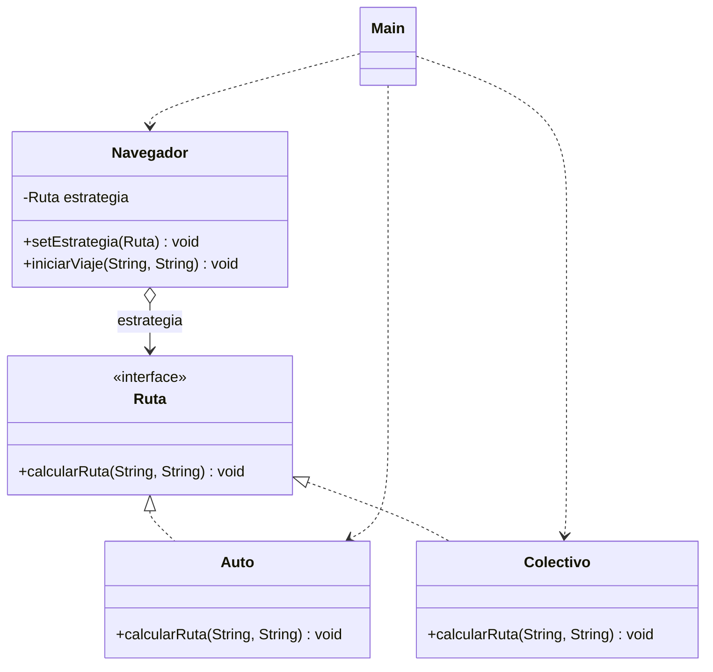

# Strategy

**Tipo:** Conductuales. **Ejemplo:** Navegador que calcula la ruta en auto o en colectivo.

## Problema

Un navegador necesita calcular rutas con distintos medios de transporte sin llenar el código de `if / else` por cada medio ni acoplarse a cada algoritmo.

## Solución

Se define el contrato `Ruta` y cada medio (`Auto`, `Colectivo`) lo implementa con su propio algoritmo. `Navegador` guarda la estrategia activa y delega en ella; el cliente puede cambiarla en tiempo de ejecución con `setEstrategia(...)`.

## Participantes y archivos

| Archivo o participante | Rol |
| --- | --- |
| `Ruta` | contrato de estrategia |
| `Auto` | estrategia concreta |
| `Colectivo` | estrategia concreta |
| `Navegador` | contexto que usa la estrategia |
| `Main` | cliente |

Cada clase o interfaz propia está en un archivo Java con su mismo nombre. `Main.java` organiza el ejemplo; no es un participante esencial del patrón.

## Diagrama UML

El diagrama resume las relaciones y operaciones relevantes del código.





## Consecuencias

- **Ventajas:** Permite agregar medios de transporte sin modificar el navegador y cambiar el algoritmo en tiempo de ejecución.
- **Costos:** Agrega una clase por estrategia y el cliente debe conocer las estrategias disponibles para elegir.

## Ejecutar y comprobar

Requiere JDK 17 o superior. Desde la raíz del repo, compilar y ejecutar en PowerShell:

```powershell
$fuentes = Get-ChildItem -Filter '*.java' 'src/main/java/com/patronesingsoft/Patrones_de_Comportamiento/Strategy'
javac --release 17 -encoding UTF-8 -d target/strategy $fuentes.FullName
java -cp target/strategy com.patronesingsoft.Patrones_de_Comportamiento.Strategy.Main
```

En el IDE, ejecutar `Main.java` de esta carpeta. Si se compila con Maven (`mvn compile`), ejecutar `java -cp target/classes com.patronesingsoft.Patrones_de_Comportamiento.Strategy.Main`.

**Qué se comprueba:** El viaje de "Mi Casa" a "Unvime" se calcula primero en auto y luego en colectivo tras cambiar la estrategia.

## Guion breve para exponer

1. Presentar el problema del ejemplo.
2. Identificar los participantes en el UML y abrir sus archivos.
3. Ejecutar `Main` y seguir las llamadas relevantes en el código comentado.
4. Explicar esta idea: `Navegador` no sabe cómo se calcula la ruta, solo delega en la estrategia configurada. Mostrar el cambio de `Auto` a `Colectivo` sin tocar `Navegador`.
5. Cerrar con una ventaja y un costo de usar el patrón.

## Referencia conceptual

[Refactoring.Guru — Strategy](https://refactoring.guru/es/design-patterns/strategy). La explicación y el UML corresponden a la implementación didáctica de este repositorio. No se copian los ejemplos de la fuente.
