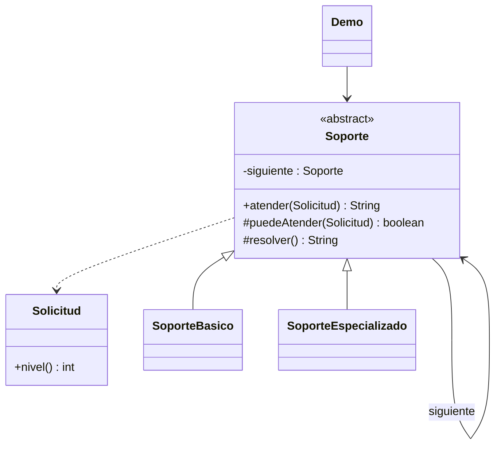

# Chain of Responsibility

**Tipo:** Conductuales. **Ejemplo:** Escalamiento de solicitudes de soporte.

## Problema

El emisor de una consulta no debería decidir directamente qué nivel de soporte debe atenderla.

## Solución

Cada Soporte decide si atiende la Solicitud. Si no puede, delega al siguiente; la cadena termina con una respuesta explícita cuando nadie puede resolverla.

## Participantes y archivos

| Archivo o participante | Rol |
| --- | --- |
| `Solicitud` | petición |
| `Soporte` | manejador base |
| `SoporteBasico`, `SoporteEspecializado` | manejadores concretos |
| `Demo` | arma la cadena y envía peticiones |

Cada clase o interfaz propia está en un archivo Java con su mismo nombre. `Demo.java` organiza el ejemplo y sus comprobaciones; no es un participante esencial del patrón. Los contratos de la biblioteca estándar no se duplican.

## Diagrama UML

El diagrama resume las relaciones y operaciones relevantes del código; omite accesores que no ayudan a explicar el patrón.



## Consecuencias

- **Ventajas:** Desacopla emisor y receptor y permite variar el orden o la composición de los responsables.
- **Costos:** El orden importa y una solicitud puede quedar sin atender; hay que definir ese resultado.

## Ejecutar y comprobar

Desde la raíz del repo, compilar primero con `./verificar.ps1` o con las instrucciones del [README general](../../../../../../../README.md).

```powershell
java -ea -cp out com.patronesingsoft.behavioral.ChainOfResponsibility.Demo
```

**Qué se comprueba:** Atención local, delegación al especialista y solicitud que llega al final sin responsable.

La opción `-ea` habilita las aserciones. Si una condición falla, Java lanza `AssertionError` y la ejecución termina con error. Las validaciones de entradas del ejemplo funcionan también sin `-ea`.

## Guion breve para exponer

1. Presentar el problema del ejemplo.
2. Identificar los participantes en el UML y abrir sus archivos.
3. Ejecutar `Demo` y seguir las llamadas relevantes en el código comentado.
4. Explicar esta idea: Seguir una petición nivel dos: el primer eslabón no la resuelve y la pasa. El cliente envía a la cadena, no al especialista.
5. Cerrar con una ventaja y un costo de usar el patrón.

## Alcance del ejemplo

Cadena inmutable tras construirse, evaluación síncrona y niveles de ejemplo del uno al tres.

## Referencia conceptual

[Refactoring.Guru — Chain of Responsibility](https://refactoring.guru/es/design-patterns/chain-of-responsibility). La explicación y el UML corresponden a la implementación didáctica de este repositorio. No se copian los ejemplos de la fuente.
