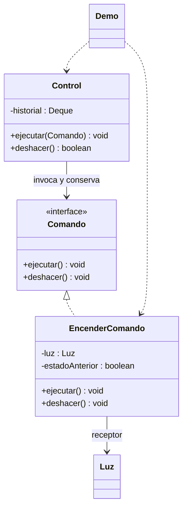

# Command

**Tipo:** Conductuales. **Ejemplo:** Encendido de una luz con deshacer.

## Problema

Un control necesita ejecutar y recordar acciones sin conocer los detalles del objeto que modifica.

## Solución

EncenderComando encapsula la Luz y su estado anterior. Control trabaja con Comando y conserva una pila para deshacer en orden inverso.

## Participantes y archivos

| Archivo o participante | Rol |
| --- | --- |
| `Comando` | contrato de comando |
| `EncenderComando` | comando concreto |
| `Luz` | receptor |
| `Control` | invocador e historial |
| `Demo` | cliente |

Cada clase o interfaz propia está en un archivo Java con su mismo nombre. `Demo.java` organiza el ejemplo y sus comprobaciones; no es un participante esencial del patrón. Los contratos de la biblioteca estándar no se duplican.

## Diagrama UML

El diagrama resume las relaciones y operaciones relevantes del código; omite accesores que no ayudan a explicar el patrón.



## Consecuencias

- **Ventajas:** Separa invocación y ejecución y permite historial, deshacer o programar acciones.
- **Costos:** El historial ocupa memoria y cada acción debe definir si es reversible y qué estado necesita conservar.

## Ejecutar y comprobar

Desde la raíz del repo, compilar primero con `./verificar.ps1` o con las instrucciones del [README general](../../../../../../../README.md).

```powershell
java -ea -cp out com.patronesingsoft.behavioral.Command.Demo
```

**Qué se comprueba:** Historial vacío, encendido, rechazo de reutilización pendiente y restauración de dos estados previos.

La opción `-ea` habilita las aserciones. Si una condición falla, Java lanza `AssertionError` y la ejecución termina con error. Las validaciones de entradas del ejemplo funcionan también sin `-ea`.

## Guion breve para exponer

1. Presentar el problema del ejemplo.
2. Identificar los participantes en el UML y abrir sus archivos.
3. Ejecutar `Demo` y seguir las llamadas relevantes en el código comentado.
4. Explicar esta idea: Deshacer no es siempre apagar: si la luz ya estaba encendida, hay que restaurar ese estado anterior.
5. Cerrar con una ventaja y un costo de usar el patrón.

## Alcance del ejemplo

Un hilo, historial en memoria y una instancia de comando por acción pendiente. No incluye rehacer ni persistencia.

## Referencia conceptual

[Refactoring.Guru — Command](https://refactoring.guru/es/design-patterns/command). La explicación y el UML corresponden a la implementación didáctica de este repositorio. No se copian los ejemplos de la fuente.
