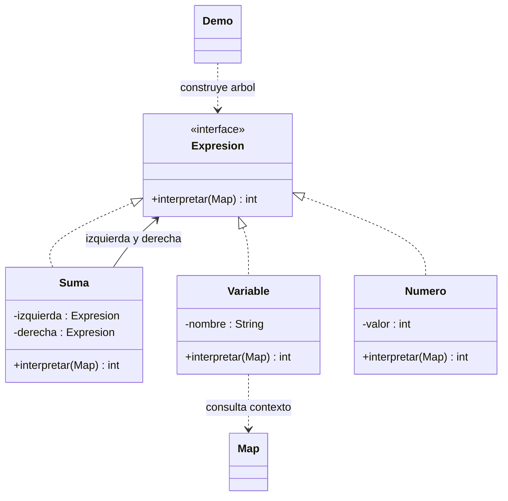

# Interpreter

**Tipo:** Conductuales. **Ejemplo:** Expresiones con números, variables y sumas.

## Problema

Se necesita evaluar repetidamente expresiones de un lenguaje pequeño usando distintos valores de variables.

## Solución

Cada regla se representa con un objeto Expresion. Numero y Variable son terminales; Suma interpreta recursivamente sus hijos usando un Map como contexto.

## Participantes y archivos

| Archivo o participante | Rol |
| --- | --- |
| `Expresion` | expresión abstracta |
| `Numero`, `Variable` | expresiones terminales |
| `Suma` | expresión no terminal |
| `Map de Java` | contexto de variables, sin clase propia |
| `Demo` | cliente que construye el árbol |

Cada clase o interfaz propia está en un archivo Java con su mismo nombre. `Demo.java` organiza el ejemplo y sus comprobaciones; no es un participante esencial del patrón. Los contratos de la biblioteca estándar no se duplican.

## Diagrama UML

El diagrama resume las relaciones y operaciones relevantes del código; omite accesores que no ayudan a explicar el patrón.



## Consecuencias

- **Ventajas:** Facilita agregar reglas pequeñas y reutilizar un árbol con contextos diferentes.
- **Costos:** Una gramática grande genera muchas clases; recorrer objetos puede ser menos eficiente que otras formas de ejecución.

## Ejecutar y comprobar

Desde la raíz del repo, compilar primero con `./verificar.ps1` o con las instrucciones del [README general](../../../../../../../README.md).

```powershell
java -ea -cp out com.patronesingsoft.behavioral.Interpreter.Demo
```

**Qué se comprueba:** Árbol anidado con dos contextos, variable no definida y desbordamiento de enteros.

La opción `-ea` habilita las aserciones. Si una condición falla, Java lanza `AssertionError` y la ejecución termina con error. Las validaciones de entradas del ejemplo funcionan también sin `-ea`.

## Guion breve para exponer

1. Presentar el problema del ejemplo.
2. Identificar los participantes en el UML y abrir sus archivos.
3. Ejecutar `Demo` y seguir las llamadas relevantes en el código comentado.
4. Explicar esta idea: La gramática es E ::= numero | variable | suma(E, E). Recorrer x + (3 + 2) y mostrar que cambia el contexto, no el árbol.
5. Cerrar con una ventaja y un costo de usar el patrón.

## Alcance del ejemplo

Árbol construido por el cliente, no analiza texto. Usa int y detecta desbordamientos al sumar.

## Referencia conceptual

[Gamma, Helm, Johnson y Vlissides — Interpreter (material alojado en MIT)](https://people.csail.mit.edu/addy/pattern/pat5c.htm). La explicación y el UML corresponden a la implementación didáctica de este repositorio. No se copian los ejemplos de la fuente.
