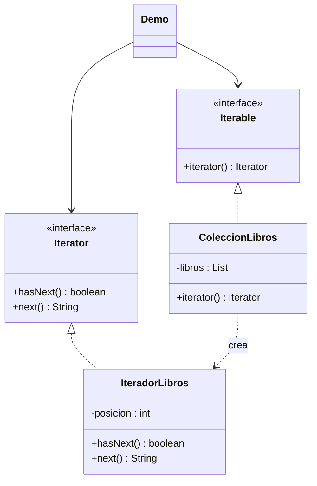

# Iterator

**Tipo:** Conductuales. **Ejemplo:** Recorrido de una colección de libros.

## Problema

El cliente debe recorrer una colección sin depender de su almacenamiento ni compartir el cursor con otros recorridos.

## Solución

ColeccionLibros implementa Iterable y crea un IteradorLibros por recorrido. Se usan los contratos Iterator e Iterable de Java.

## Participantes y archivos

| Archivo o participante | Rol |
| --- | --- |
| `ColeccionLibros` | agregado concreto |
| `IteradorLibros` | iterador concreto |
| `Iterable`, `Iterator de Java` | contratos estándar |
| `Demo` | cliente |

Cada clase o interfaz propia está en un archivo Java con su mismo nombre. `Demo.java` organiza el ejemplo y sus comprobaciones; no es un participante esencial del patrón. Los contratos de la biblioteca estándar no se duplican.

## Diagrama UML

El diagrama resume las relaciones y operaciones relevantes del código; omite accesores que no ayudan a explicar el patrón.



## Consecuencias

- **Ventajas:** Oculta la representación y permite varios recorridos independientes.
- **Costos:** Es necesario definir el comportamiento al agotarse y qué sucede si la colección cambia durante el recorrido.

## Ejecutar y comprobar

Desde la raíz del repo, compilar primero con `./verificar.ps1` o con las instrucciones del [README general](../../../../../../../README.md).

```powershell
java -ea -cp out com.patronesingsoft.behavioral.Iterator.Demo
```

**Qué se comprueba:** Orden completo, cursores independientes, colección vacía y excepción al agotar next().

La opción `-ea` habilita las aserciones. Si una condición falla, Java lanza `AssertionError` y la ejecución termina con error. Las validaciones de entradas del ejemplo funcionan también sin `-ea`.

## Guion breve para exponer

1. Presentar el problema del ejemplo.
2. Identificar los participantes en el UML y abrir sus archivos.
3. Ejecutar `Demo` y seguir las llamadas relevantes en el código comentado.
4. Explicar esta idea: hasNext() consulta y next() avanza. Mostrar que for-each usa el mismo contrato Iterable.
5. Cerrar con una ventaja y un costo de usar el patrón.

## Alcance del ejemplo

Colección inmutable de títulos; no admite quitar libros mediante el iterador.

## Referencia conceptual

[Refactoring.Guru — Iterator](https://refactoring.guru/es/design-patterns/iterator). La explicación y el UML corresponden a la implementación didáctica de este repositorio. No se copian los ejemplos de la fuente.
