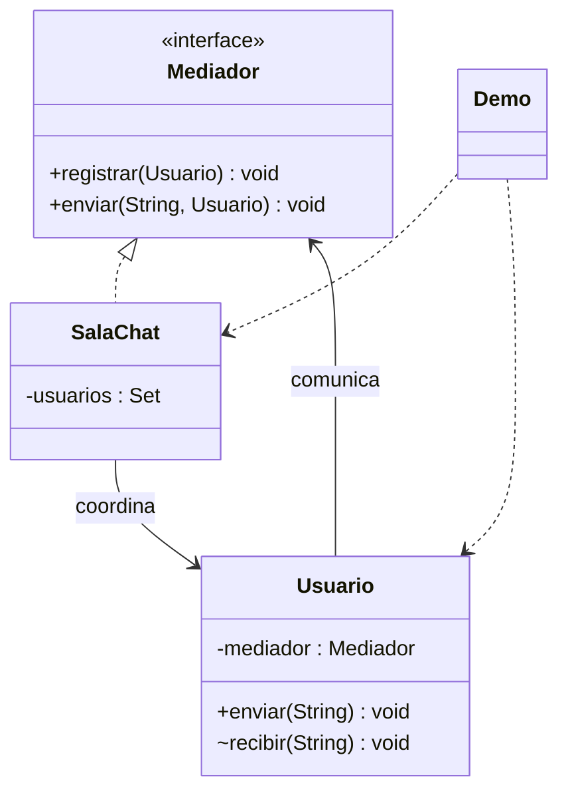

# Mediator

**Tipo:** Conductuales. **Ejemplo:** Sala de chat del equipo.

## Problema

Si cada usuario conoce directamente a todos los demás, la coordinación y las referencias crecen con cada participante.

## Solución

Usuario envía al Mediador. SalaChat centraliza el registro y distribuye el mensaje a los demás usuarios.

## Participantes y archivos

| Archivo o participante | Rol |
| --- | --- |
| `Mediador` | mediador abstracto |
| `SalaChat` | mediador concreto |
| `Usuario` | colega |
| `Demo` | cliente que registra usuarios |

Cada clase o interfaz propia está en un archivo Java con su mismo nombre. `Demo.java` organiza el ejemplo y sus comprobaciones; no es un participante esencial del patrón. Los contratos de la biblioteca estándar no se duplican.

## Diagrama UML

El diagrama resume las relaciones y operaciones relevantes del código; omite accesores que no ayudan a explicar el patrón.



## Consecuencias

- **Ventajas:** Reduce dependencias entre colegas y concentra las reglas de comunicación.
- **Costos:** El mediador puede convertirse en una clase demasiado grande o en un punto central de fallos.

## Ejecutar y comprobar

Desde la raíz del repo, compilar primero con `./verificar.ps1` o con las instrucciones del [README general](../../../../../../../README.md).

```powershell
java -ea -cp out com.patronesingsoft.behavioral.Mediator.Demo
```

**Qué se comprueba:** Distribución sin eco al emisor, registro duplicado, emisor no registrado y usuario de otra sala.

La opción `-ea` habilita las aserciones. Si una condición falla, Java lanza `AssertionError` y la ejecución termina con error. Las validaciones de entradas del ejemplo funcionan también sin `-ea`.

## Guion breve para exponer

1. Presentar el problema del ejemplo.
2. Identificar los participantes en el UML y abrir sus archivos.
3. Ejecutar `Demo` y seguir las llamadas relevantes en el código comentado.
4. Explicar esta idea: Usuario no almacena una lista de compañeros. Comparar con Observer: el mediador coordina la comunicación entre colegas.
5. Cerrar con una ventaja y un costo de usar el patrón.

## Alcance del ejemplo

Sala en memoria, un hilo y sin red; la pertenencia al objeto sala no equivale a autenticar personas.

## Referencia conceptual

[Refactoring.Guru — Mediator](https://refactoring.guru/es/design-patterns/mediator). La explicación y el UML corresponden a la implementación didáctica de este repositorio. No se copian los ejemplos de la fuente.
