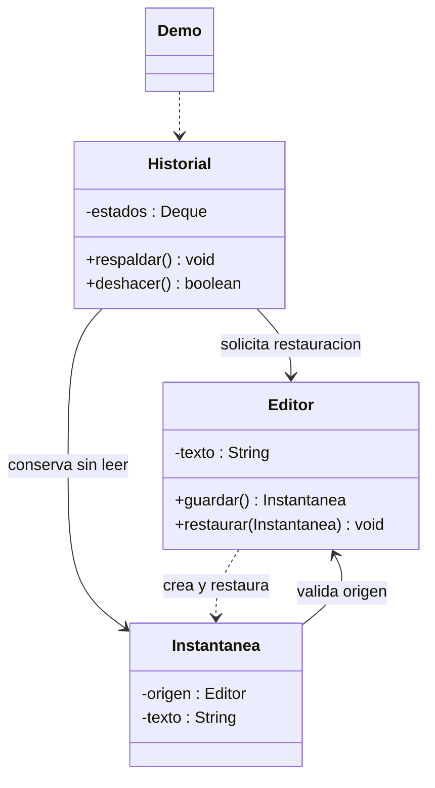

# Memento

**Tipo:** Conductuales. **Ejemplo:** Restauración de versiones de un editor.

## Problema

Se necesita recuperar un estado anterior sin hacer que el historial conozca y manipule los detalles internos del editor.

## Solución

Editor crea Instantanea inmutable. Historial conserva esos objetos y pide al editor que los restaure, sin leer su contenido.

## Participantes y archivos

| Archivo o participante | Rol |
| --- | --- |
| `Editor` | originador |
| `Instantanea` | memento inmutable |
| `Historial` | cuidador |
| `Demo` | cliente |

Cada clase o interfaz propia está en un archivo Java con su mismo nombre. `Demo.java` organiza el ejemplo y sus comprobaciones; no es un participante esencial del patrón. Los contratos de la biblioteca estándar no se duplican.

## Diagrama UML

El diagrama resume las relaciones y operaciones relevantes del código; omite accesores que no ayudan a explicar el patrón.



## Consecuencias

- **Ventajas:** Separa conservación y restauración del estado y permite deshacer sin exponerlo al cuidador.
- **Costos:** Guardar muchos estados puede consumir memoria; hay que definir el tamaño del historial y la validez de las instantáneas.

## Ejecutar y comprobar

Desde la raíz del repo, compilar primero con `./verificar.ps1` o con las instrucciones del [README general](../../../../../../../README.md).

```powershell
java -ea -cp out com.patronesingsoft.behavioral.Memento.Demo
```

**Qué se comprueba:** Dos restauraciones sucesivas, historial vacío y rechazo de instantánea ajena sin alterar el estado.

La opción `-ea` habilita las aserciones. Si una condición falla, Java lanza `AssertionError` y la ejecución termina con error. Las validaciones de entradas del ejemplo funcionan también sin `-ea`.

## Guion breve para exponer

1. Presentar el problema del ejemplo.
2. Identificar los participantes en el UML y abrir sus archivos.
3. Ejecutar `Demo` y seguir las llamadas relevantes en el código comentado.
4. Explicar esta idea: Historial solo guarda y entrega tokens. Comparar con Command: se conserva una fotografía del estado, no una acción inversa.
5. Cerrar con una ventaja y un costo de usar el patrón.

## Alcance del ejemplo

Texto inmutable e historial en memoria sin límite automático. Los accesores de Instantanea son visibles solo en el paquete, no para clientes externos.

## Referencia conceptual

[Refactoring.Guru — Memento](https://refactoring.guru/es/design-patterns/memento). La explicación y el UML corresponden a la implementación didáctica de este repositorio. No se copian los ejemplos de la fuente.
