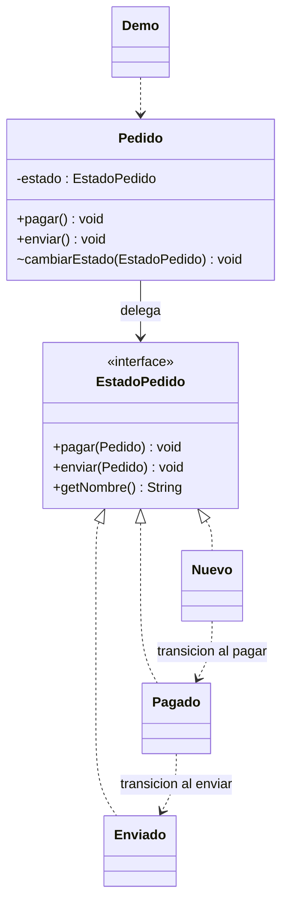

# State

**Tipo:** Conductuales. **Ejemplo:** Pedido nuevo, pagado y enviado.

## Problema

Las operaciones de un pedido dependen de su estado y grandes condicionales duplican las reglas de transición.

## Solución

Pedido delega en EstadoPedido. Nuevo, Pagado y Enviado definen acciones válidas y cambian el estado cuando corresponde.

## Participantes y archivos

| Archivo o participante | Rol |
| --- | --- |
| `Pedido` | contexto |
| `EstadoPedido` | estado abstracto |
| `Nuevo`, `Pagado`, `Enviado` | estados concretos |
| `Demo` | cliente |

Cada clase o interfaz propia está en un archivo Java con su mismo nombre. `Demo.java` organiza el ejemplo y sus comprobaciones; no es un participante esencial del patrón. Los contratos de la biblioteca estándar no se duplican.

## Diagrama UML

El diagrama resume las relaciones y operaciones relevantes del código; omite accesores que no ayudan a explicar el patrón.



## Consecuencias

- **Ventajas:** Localiza las reglas de cada estado y hace explícitas las transiciones.
- **Costos:** Agrega clases y las transiciones distribuidas deben mantenerse coherentes.

## Ejecutar y comprobar

Desde la raíz del repo, compilar primero con `./verificar.ps1` o con las instrucciones del [README general](../../../../../../../README.md).

```powershell
java -ea -cp out com.patronesingsoft.behavioral.State.Demo
```

**Qué se comprueba:** Flujo Nuevo → Pagado → Enviado y rechazo de envío anticipado, pago repetido y operaciones posteriores al envío.

La opción `-ea` habilita las aserciones. Si una condición falla, Java lanza `AssertionError` y la ejecución termina con error. Las validaciones de entradas del ejemplo funcionan también sin `-ea`.

## Guion breve para exponer

1. Presentar el problema del ejemplo.
2. Identificar los participantes en el UML y abrir sus archivos.
3. Ejecutar `Demo` y seguir las llamadas relevantes en el código comentado.
4. Explicar esta idea: Pedido no tiene un switch de estados. El objeto estado decide si la operación es válida y cuál es la transición.
5. Cerrar con una ventaja y un costo de usar el patrón.

## Alcance del ejemplo

Estados en memoria, sin pagos reales ni persistencia. No se modelan cancelaciones o devoluciones.

## Referencia conceptual

[Refactoring.Guru — State](https://refactoring.guru/es/design-patterns/state). La explicación y el UML corresponden a la implementación didáctica de este repositorio. No se copian los ejemplos de la fuente.
