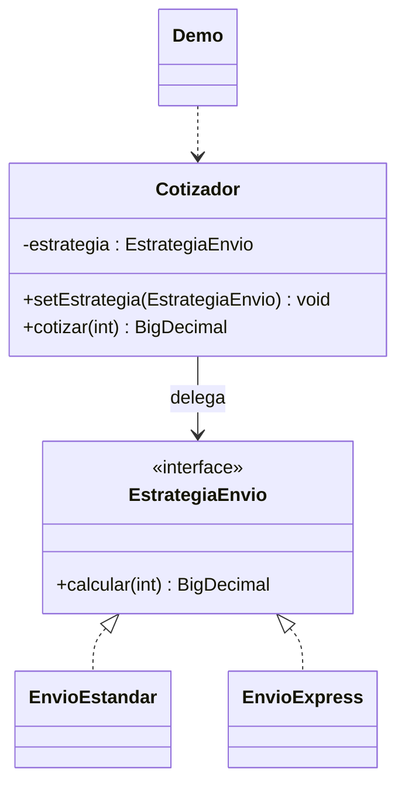

# Strategy

**Tipo:** Conductuales. **Ejemplo:** Cotización de envío estándar o express.

## Problema

Un cotizador necesita elegir y cambiar algoritmos de envío sin acumular condicionales ni modificar su lógica para cada tarifa.

## Solución

Cotizador delega el cálculo en EstrategiaEnvio. EnvioEstandar y EnvioExpress implementan algoritmos intercambiables.

## Participantes y archivos

| Archivo o participante | Rol |
| --- | --- |
| `EstrategiaEnvio` | contrato de estrategia |
| `EnvioEstandar`, `EnvioExpress` | estrategias concretas |
| `Cotizador` | contexto |
| `Demo` | cliente que selecciona algoritmos |

Cada clase o interfaz propia está en un archivo Java con su mismo nombre. `Demo.java` organiza el ejemplo y sus comprobaciones; no es un participante esencial del patrón. Los contratos de la biblioteca estándar no se duplican.

## Diagrama UML

El diagrama resume las relaciones y operaciones relevantes del código; omite accesores que no ayudan a explicar el patrón.



## Consecuencias

- **Ventajas:** Separa algoritmos y permite cambiarlos en ejecución o probarlos por separado.
- **Costos:** El cliente debe conocer las alternativas y cada estrategia introduce un participante adicional.

## Ejecutar y comprobar

Desde la raíz del repo, compilar primero con `./verificar.ps1` o con las instrucciones del [README general](../../../../../../../README.md).

```powershell
java -ea -cp out com.patronesingsoft.behavioral.Strategy.Demo
```

**Qué se comprueba:** Importes para tres kilos, cambio de estrategia, peso no positivo y estrategia nula.

La opción `-ea` habilita las aserciones. Si una condición falla, Java lanza `AssertionError` y la ejecución termina con error. Las validaciones de entradas del ejemplo funcionan también sin `-ea`.

## Guion breve para exponer

1. Presentar el problema del ejemplo.
2. Identificar los participantes en el UML y abrir sus archivos.
3. Ejecutar `Demo` y seguir las llamadas relevantes en el código comentado.
4. Explicar esta idea: El mismo Cotizador pasa de estándar a express. A diferencia de State, el cliente elige el algoritmo, no una transición del ciclo de vida.
5. Cerrar con una ventaja y un costo de usar el patrón.

## Alcance del ejemplo

Tarifas ficticias en unidades monetarias con BigDecimal; pesos enteros positivos. No consulta precios reales.

## Referencia conceptual

[Refactoring.Guru — Strategy](https://refactoring.guru/es/design-patterns/strategy). La explicación y el UML corresponden a la implementación didáctica de este repositorio. No se copian los ejemplos de la fuente.
