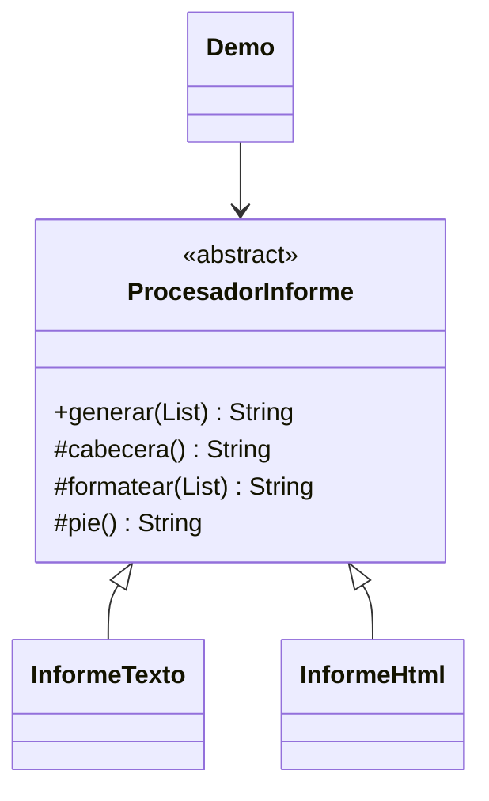

# Template Method

**Tipo:** Conductuales. **Ejemplo:** Informes de texto y HTML.

## Problema

Dos formatos de informe repiten la secuencia de cabecera, contenido y pie, aunque cada paso varía.

## Solución

ProcesadorInforme fija generar() como final y delega cabecera y formatear a subclases. pie() es un hook opcional que HTML sobrescribe.

## Participantes y archivos

| Archivo o participante | Rol |
| --- | --- |
| `ProcesadorInforme` | clase abstracta con método plantilla |
| `InformeTexto`, `InformeHtml` | clases concretas |
| `Demo` | cliente |

Cada clase o interfaz propia está en un archivo Java con su mismo nombre. `Demo.java` organiza el ejemplo y sus comprobaciones; no es un participante esencial del patrón. Los contratos de la biblioteca estándar no se duplican.

## Diagrama UML

El diagrama resume las relaciones y operaciones relevantes del código; omite accesores que no ayudan a explicar el patrón.



## Consecuencias

- **Ventajas:** Reutiliza la secuencia común y controla qué partes pueden cambiar.
- **Costos:** Depende de herencia; muchos pasos o hooks pueden hacer difícil entender la plantilla.

## Ejecutar y comprobar

Desde la raíz del repo, compilar primero con `./verificar.ps1` o con las instrucciones del [README general](../../../../../../../README.md).

```powershell
java -ea -cp out com.patronesingsoft.behavioral.TemplateMethod.Demo
```

**Qué se comprueba:** Secuencia de ambos formatos, colección vacía y escape de texto con signos HTML.

La opción `-ea` habilita las aserciones. Si una condición falla, Java lanza `AssertionError` y la ejecución termina con error. Las validaciones de entradas del ejemplo funcionan también sin `-ea`.

## Guion breve para exponer

1. Presentar el problema del ejemplo.
2. Identificar los participantes en el UML y abrir sus archivos.
3. Ejecutar `Demo` y seguir las llamadas relevantes en el código comentado.
4. Explicar esta idea: generar() mantiene el orden y las subclases completan pasos. pie() demuestra un hook con implementación por defecto. Comparar herencia con la composición de Strategy.
5. Cerrar con una ventaja y un costo de usar el patrón.

## Alcance del ejemplo

Genera texto y fragmentos HTML en memoria; no escribe archivos. El UML resume generar(), que es final en Java.

## Referencia conceptual

[Refactoring.Guru — Template Method](https://refactoring.guru/es/design-patterns/template-method). La explicación y el UML corresponden a la implementación didáctica de este repositorio. No se copian los ejemplos de la fuente.
