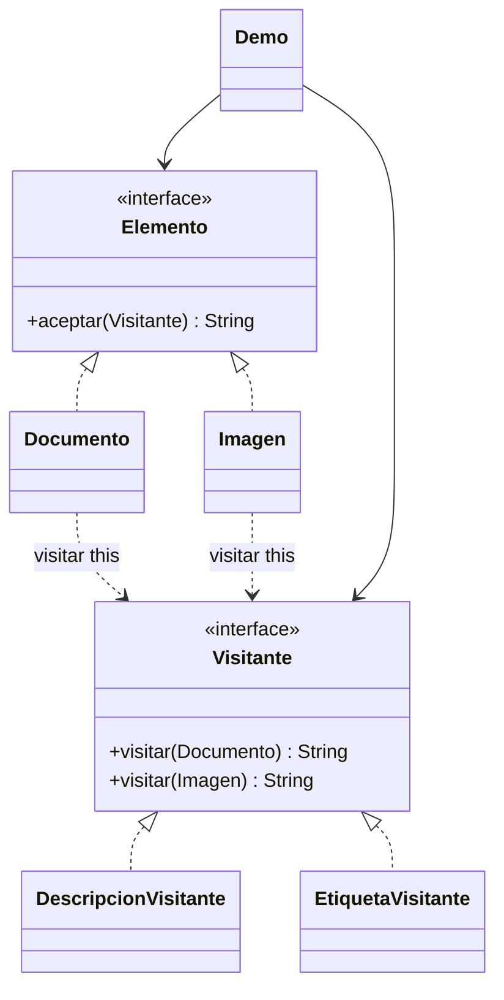

# Visitor

**Tipo:** Conductuales. **Ejemplo:** Descripción y etiquetas de documentos e imágenes.

## Problema

Se quieren agregar operaciones a varios tipos de elementos sin modificar cada clase cada vez que aparece una operación nueva.

## Solución

Cada Elemento acepta un Visitante y llama visitar(this). DescripcionVisitante y EtiquetaVisitante contienen operaciones diferentes para Documento e Imagen.

## Participantes y archivos

| Archivo o participante | Rol |
| --- | --- |
| `Elemento` | elemento abstracto |
| `Documento`, `Imagen` | elementos concretos |
| `Visitante` | visitante abstracto |
| `DescripcionVisitante`, `EtiquetaVisitante` | visitantes concretos |
| `Demo` | cliente |

Cada clase o interfaz propia está en un archivo Java con su mismo nombre. `Demo.java` organiza el ejemplo y sus comprobaciones; no es un participante esencial del patrón. Los contratos de la biblioteca estándar no se duplican.

## Diagrama UML

El diagrama resume las relaciones y operaciones relevantes del código; omite accesores que no ayudan a explicar el patrón.



## Consecuencias

- **Ventajas:** Agrupa cada operación y permite sumar visitantes sin cambiar los elementos existentes.
- **Costos:** Agregar un nuevo tipo de elemento obliga a ampliar Visitante y todos sus visitantes; puede requerir exponer datos de los elementos.

## Ejecutar y comprobar

Desde la raíz del repo, compilar primero con `./verificar.ps1` o con las instrucciones del [README general](../../../../../../../README.md).

```powershell
java -ea -cp out com.patronesingsoft.behavioral.Visitor.Demo
```

**Qué se comprueba:** Las dos operaciones sobre ambos tipos de elemento, sin instanceof en los visitantes.

La opción `-ea` habilita las aserciones. Si una condición falla, Java lanza `AssertionError` y la ejecución termina con error. Las validaciones de entradas del ejemplo funcionan también sin `-ea`.

## Guion breve para exponer

1. Presentar el problema del ejemplo.
2. Identificar los participantes en el UML y abrir sus archivos.
3. Ejecutar `Demo` y seguir las llamadas relevantes en el código comentado.
4. Explicar esta idea: Seguir aceptar() → visitar(this): el tipo del elemento elige la sobrecarga y el visitante elegido determina la operación. Eso es doble despacho.
5. Cerrar con una ventaja y un costo de usar el patrón.

## Alcance del ejemplo

Conjunto estable de dos tipos y operaciones que devuelven texto; no procesa documentos o imágenes reales.

## Referencia conceptual

[Refactoring.Guru — Visitor](https://refactoring.guru/es/design-patterns/visitor). La explicación y el UML corresponden a la implementación didáctica de este repositorio. No se copian los ejemplos de la fuente.
