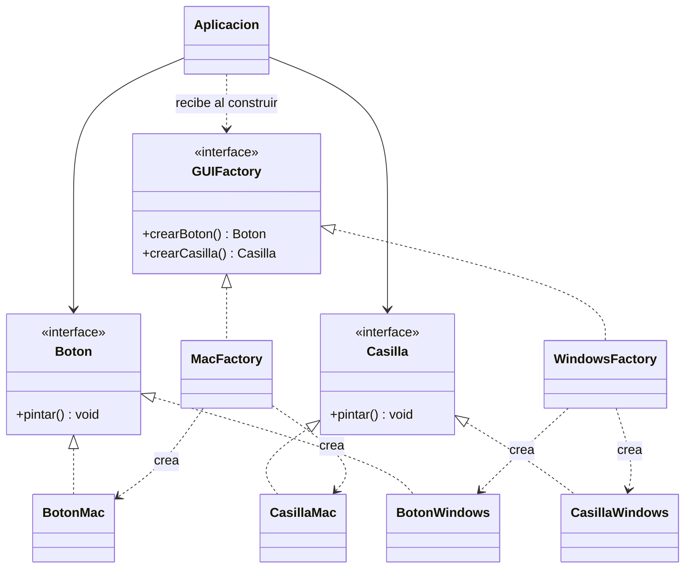

# Abstract Factory

**Tipo:** Creacionales. **Ejemplo:** Controles Windows y macOS.

## Problema

Una aplicación necesita botones y casillas de un mismo estilo. Crear cada control por separado permite mezclar familias incompatibles.

## Solución

GUIFactory declara la creación de los dos productos. MacFactory y WindowsFactory producen familias completas; Aplicacion consume sus interfaces.

## Participantes y archivos

| Archivo o participante | Rol |
| --- | --- |
| `GUIFactory` | fábrica abstracta |
| `MacFactory`, `WindowsFactory` | fábricas concretas |
| `Boton`, `Casilla` | productos abstractos |
| `BotonMac`, `BotonWindows`, `CasillaMac`, `CasillaWindows` | productos concretos |
| `Aplicacion` | cliente de la fábrica |
| `Demo` | elige y comprueba ambas familias |

Cada clase o interfaz propia está en un archivo Java con su mismo nombre. `Demo.java` organiza el ejemplo y sus comprobaciones; no es un participante esencial del patrón. Los contratos de la biblioteca estándar no se duplican.

## Diagrama UML

El diagrama resume las relaciones y operaciones relevantes del código; omite accesores que no ayudan a explicar el patrón.



## Consecuencias

- **Ventajas:** Mantiene la coherencia de los productos y permite cambiar de familia sin modificar el cliente.
- **Costos:** Agregar un nuevo tipo de producto obliga a ampliar la interfaz de fábrica y todas sus implementaciones.

## Ejecutar y comprobar

Desde la raíz del repo, compilar primero con `./verificar.ps1` o con las instrucciones del [README general](../../../../../../../README.md).

```powershell
java -ea -cp out com.patronesingsoft.creational.AbstractFactory.Demo
```

**Qué se comprueba:** Tipos de ambos productos en cada familia.

La opción `-ea` habilita las aserciones. Si una condición falla, Java lanza `AssertionError` y la ejecución termina con error. Las validaciones de entradas del ejemplo funcionan también sin `-ea`.

## Guion breve para exponer

1. Presentar el problema del ejemplo.
2. Identificar los participantes en el UML y abrir sus archivos.
3. Ejecutar `Demo` y seguir las llamadas relevantes en el código comentado.
4. Explicar esta idea: Cambiar la fábrica cambia juntos el botón y la casilla. Comparar con Factory Method, que delega la creación de un producto.
5. Cerrar con una ventaja y un costo de usar el patrón.

## Alcance del ejemplo

Los controles se representan con mensajes de consola; no se abre una interfaz gráfica.

## Referencia conceptual

[Refactoring.Guru — Abstract Factory](https://refactoring.guru/es/design-patterns/abstract-factory). La explicación y el UML corresponden a la implementación didáctica de este repositorio. No se copian los ejemplos de la fuente.
