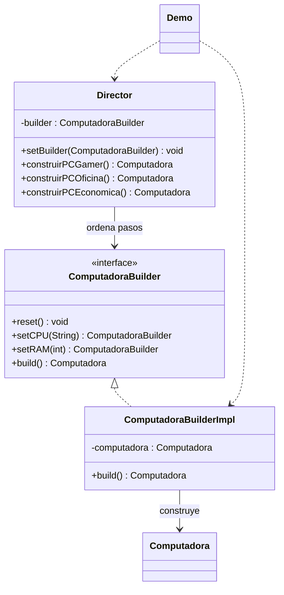

# Builder

**Tipo:** Creacionales. **Ejemplo:** Armado de computadoras.

## Problema

Una computadora admite muchos componentes y opciones. Un constructor con numerosos argumentos resulta difícil de leer y es fácil confundir sus posiciones.

## Solución

ComputadoraBuilder define pasos; ComputadoraBuilderImpl acumula los componentes y entrega el producto. Director reúne recetas gamer, oficina y económica.

## Participantes y archivos

| Archivo o participante | Rol |
| --- | --- |
| `Computadora` | producto |
| `ComputadoraBuilder` | contrato de construcción |
| `ComputadoraBuilderImpl` | constructor concreto |
| `Director` | recetas opcionales |
| `Demo` | cliente con y sin Director |

Cada clase o interfaz propia está en un archivo Java con su mismo nombre. `Demo.java` organiza el ejemplo y sus comprobaciones; no es un participante esencial del patrón. Los contratos de la biblioteca estándar no se duplican.

## Diagrama UML

El diagrama resume las relaciones y operaciones relevantes del código; omite accesores que no ayudan a explicar el patrón.



## Consecuencias

- **Ventajas:** Permite construir paso a paso, reutilizar recetas y crear configuraciones personalizadas.
- **Costos:** Introduce participantes adicionales y exige definir cuándo un producto está listo y cómo se reinicia el constructor.

## Ejecutar y comprobar

Desde la raíz del repo, compilar primero con `./verificar.ps1` o con las instrucciones del [README general](../../../../../../../README.md).

```powershell
java -ea -cp out com.patronesingsoft.creational.Builder.Demo
```

**Qué se comprueba:** Recetas del Director, construcción personalizada, validación de campos mínimos e independencia al reutilizar el builder.

La opción `-ea` habilita las aserciones. Si una condición falla, Java lanza `AssertionError` y la ejecución termina con error. Las validaciones de entradas del ejemplo funcionan también sin `-ea`.

## Guion breve para exponer

1. Presentar el problema del ejemplo.
2. Identificar los participantes en el UML y abrir sus archivos.
3. Ejecutar `Demo` y seguir las llamadas relevantes en el código comentado.
4. Explicar esta idea: Mostrar los setters encadenados y luego build(). El Director determina la receta; el Builder ejecuta los pasos. El Director es opcional.
5. Cerrar con una ventaja y un costo de usar el patrón.

## Alcance del ejemplo

Se conserva el producto mutable del equipo. El ejemplo valida CPU, RAM y los componentes configurados; no verifica compatibilidad física del hardware.

## Referencia conceptual

[Refactoring.Guru — Builder](https://refactoring.guru/es/design-patterns/builder). La explicación y el UML corresponden a la implementación didáctica de este repositorio. No se copian los ejemplos de la fuente.
