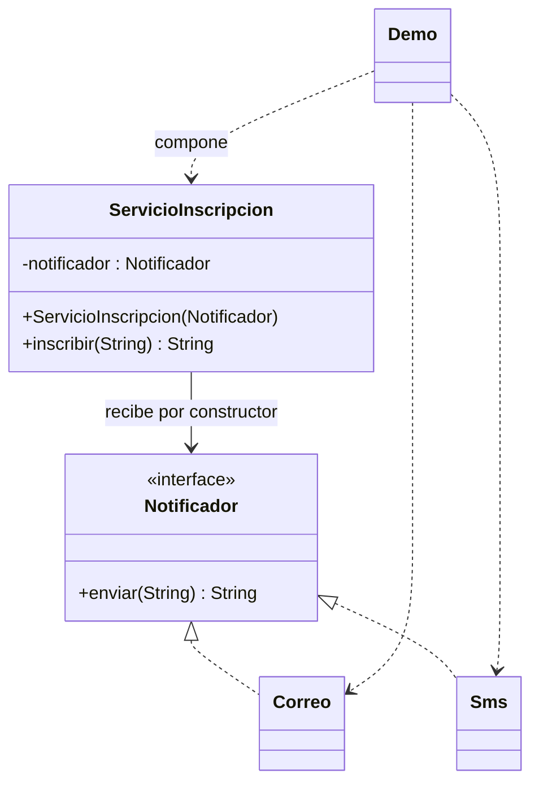

# Dependency Injection

**Tipo:** Creacionales. **Ejemplo:** Confirmaciones de inscripción.

## Problema

Si el servicio crea directamente su canal de notificación, cambiar de canal o probarlo obliga a modificar su código.

## Solución

ServicioInscripcion recibe un Notificador por constructor. Demo compone el servicio con Correo, Sms o una dependencia de prueba.

## Participantes y archivos

| Archivo o participante | Rol |
| --- | --- |
| `Notificador` | contrato de dependencia |
| `Correo`, `Sms` | dependencias concretas simuladas |
| `ServicioInscripcion` | cliente que recibe la dependencia |
| `Demo` | punto de composición |

Cada clase o interfaz propia está en un archivo Java con su mismo nombre. `Demo.java` organiza el ejemplo y sus comprobaciones; no es un participante esencial del patrón. Los contratos de la biblioteca estándar no se duplican.

## Diagrama UML

El diagrama resume las relaciones y operaciones relevantes del código; omite accesores que no ayudan a explicar el patrón.



## Consecuencias

- **Ventajas:** Reduce el acoplamiento y facilita sustituir dependencias y probar al cliente.
- **Costos:** La composición debe garantizar dependencias válidas y decidir quién administra su ciclo de vida.

## Ejecutar y comprobar

Desde la raíz del repo, compilar primero con `./verificar.ps1` o con las instrucciones del [README general](../../../../../../../README.md).

```powershell
java -ea -cp out com.patronesingsoft.creational.DependencyInjection.Demo
```

**Qué se comprueba:** Dos implementaciones, una dependencia de prueba y rechazo de nombre vacío.

La opción `-ea` habilita las aserciones. Si una condición falla, Java lanza `AssertionError` y la ejecución termina con error. Las validaciones de entradas del ejemplo funcionan también sin `-ea`.

## Guion breve para exponer

1. Presentar el problema del ejemplo.
2. Identificar los participantes en el UML y abrir sus archivos.
3. Ejecutar `Demo` y seguir las llamadas relevantes en el código comentado.
4. Explicar esta idea: Señalar que el servicio no ejecuta new Correo(). La inyección puede hacerse con Java puro; no exige Spring.
5. Cerrar con una ventaja y un costo de usar el patrón.

## Alcance del ejemplo

Las notificaciones devuelven texto; no envían mensajes reales.

## Referencia conceptual

[Martin Fowler — Dependency Injection](https://martinfowler.com/articles/injection.html). La explicación y el UML corresponden a la implementación didáctica de este repositorio. No se copian los ejemplos de la fuente.
