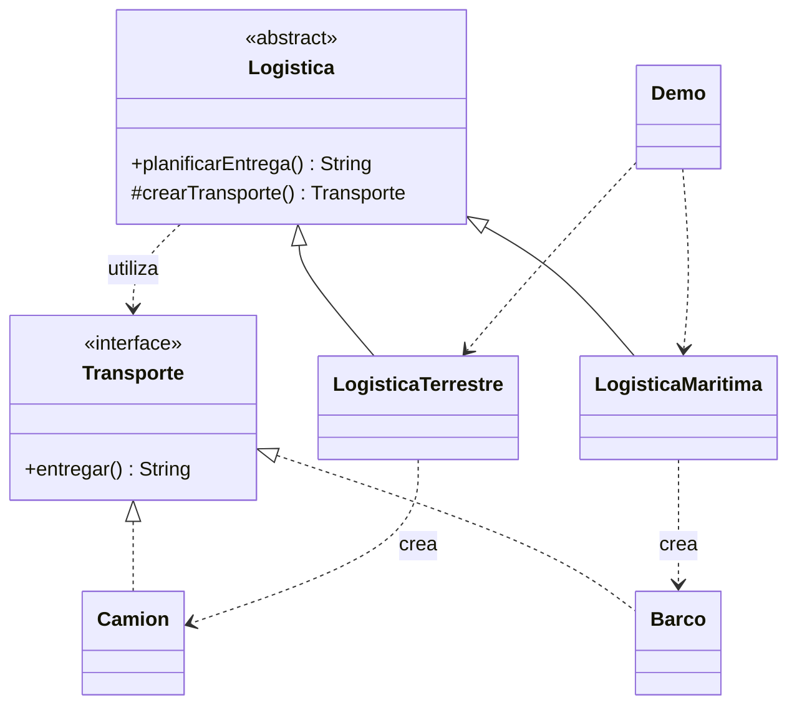

# Factory Method

**Tipo:** Creacionales. **Ejemplo:** Logística terrestre y marítima.

## Problema

La lógica de entrega no debería depender de construir un vehículo específico cada vez que se agrega un tipo de transporte.

## Solución

Logistica define planificarEntrega() y delega la creación a crearTransporte(). Sus subclases eligen Camion o Barco.

## Participantes y archivos

| Archivo o participante | Rol |
| --- | --- |
| `Transporte` | producto abstracto |
| `Camion`, `Barco` | productos concretos |
| `Logistica` | creador |
| `LogisticaTerrestre`, `LogisticaMaritima` | creadores concretos |
| `Demo` | cliente |

Cada clase o interfaz propia está en un archivo Java con su mismo nombre. `Demo.java` organiza el ejemplo y sus comprobaciones; no es un participante esencial del patrón. Los contratos de la biblioteca estándar no se duplican.

## Diagrama UML

El diagrama resume las relaciones y operaciones relevantes del código; omite accesores que no ayudan a explicar el patrón.



## Consecuencias

- **Ventajas:** Reutiliza el flujo del creador y permite extender los productos sin modificarlo.
- **Costos:** Cada variante puede exigir una subclase de creador; una simple creación aislada puede no justificar esa jerarquía.

## Ejecutar y comprobar

Desde la raíz del repo, compilar primero con `./verificar.ps1` o con las instrucciones del [README general](../../../../../../../README.md).

```powershell
java -ea -cp out com.patronesingsoft.creational.FactoryMethod.Demo
```

**Qué se comprueba:** La entrega terrestre utiliza un camión y la marítima un barco.

La opción `-ea` habilita las aserciones. Si una condición falla, Java lanza `AssertionError` y la ejecución termina con error. Las validaciones de entradas del ejemplo funcionan también sin `-ea`.

## Guion breve para exponer

1. Presentar el problema del ejemplo.
2. Identificar los participantes en el UML y abrir sus archivos.
3. Ejecutar `Demo` y seguir las llamadas relevantes en el código comentado.
4. Explicar esta idea: La sobrescritura de crearTransporte() es el patrón. No confundirlo con una función estática que elige productos con un switch.
5. Cerrar con una ventaja y un costo de usar el patrón.

## Alcance del ejemplo

Las entregas son mensajes de consola.

## Referencia conceptual

[Refactoring.Guru — Factory Method](https://refactoring.guru/es/design-patterns/factory-method). La explicación y el UML corresponden a la implementación didáctica de este repositorio. No se copian los ejemplos de la fuente.
