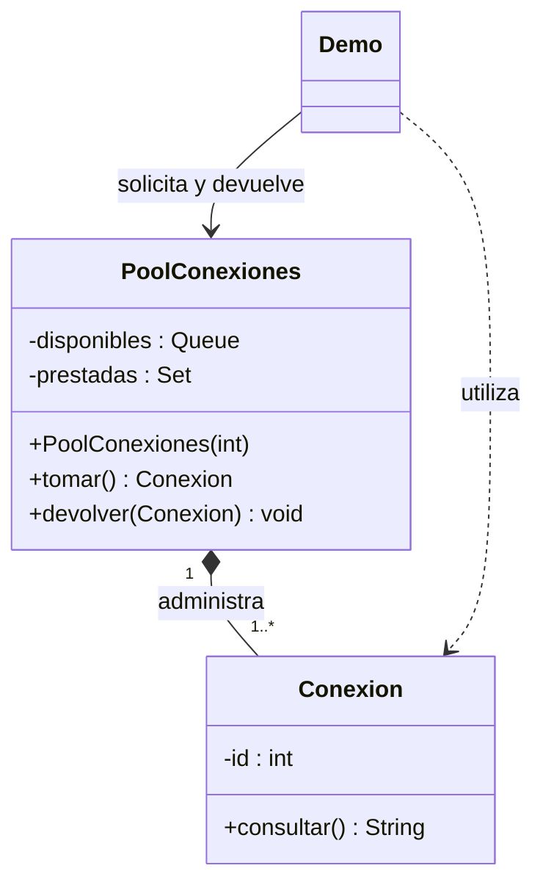

# Object Pool

**Tipo:** Creacionales. **Ejemplo:** Préstamo de conexiones simuladas.

## Problema

Crear y descartar un recurso costoso en cada operación desperdicia trabajo; además se necesita limitar la cantidad disponible.

## Solución

PoolConexiones crea una cantidad fija de recursos, presta uno disponible y lo recupera al devolverlo.

## Participantes y archivos

| Archivo o participante | Rol |
| --- | --- |
| `Conexion` | recurso reutilizable simulado |
| `PoolConexiones` | administra disponibles y prestadas |
| `Demo` | cliente que devuelve en finally |

Cada clase o interfaz propia está en un archivo Java con su mismo nombre. `Demo.java` organiza el ejemplo y sus comprobaciones; no es un participante esencial del patrón. Los contratos de la biblioteca estándar no se duplican.

## Diagrama UML

El diagrama resume las relaciones y operaciones relevantes del código; omite accesores que no ayudan a explicar el patrón.



## Consecuencias

- **Ventajas:** Reutiliza instancias y limita el uso simultáneo de recursos.
- **Costos:** El cliente debe devolver los préstamos y el pool debe controlar agotamiento, pertenencia, limpieza y concurrencia.

## Ejecutar y comprobar

Desde la raíz del repo, compilar primero con `./verificar.ps1` o con las instrucciones del [README general](../../../../../../../README.md).

```powershell
java -ea -cp out com.patronesingsoft.creational.ObjectPool.Demo
```

**Qué se comprueba:** Agotamiento, rechazo de recurso ajeno, doble devolución y reutilización de la misma instancia.

La opción `-ea` habilita las aserciones. Si una condición falla, Java lanza `AssertionError` y la ejecución termina con error. Las validaciones de entradas del ejemplo funcionan también sin `-ea`.

## Guion breve para exponer

1. Presentar el problema del ejemplo.
2. Identificar los participantes en el UML y abrir sus archivos.
3. Ejecutar `Demo` y seguir las llamadas relevantes en el código comentado.
4. Explicar esta idea: Diferenciar reutilizar un objeto de crear uno nuevo. finally garantiza la devolución aunque falle el uso.
5. Cerrar con una ventaja y un costo de usar el patrón.

## Alcance del ejemplo

Un solo hilo, capacidad fija y error inmediato al agotarse. Las conexiones no mantienen estado de sesión. Para recursos reales usar un pool especializado.

## Referencia conceptual

[Apache Commons Pool — documentación del proyecto](https://commons.apache.org/proper/commons-pool/). La explicación y el UML corresponden a la implementación didáctica de este repositorio. No se copian los ejemplos de la fuente.
