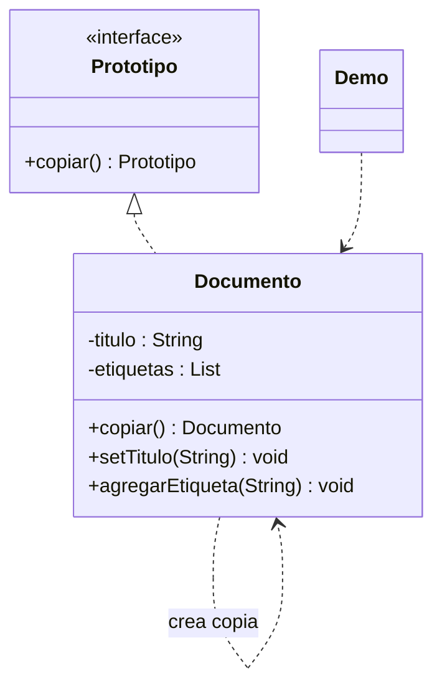

# Prototype

**Tipo:** Creacionales. **Ejemplo:** Copia de documentos con etiquetas.

## Problema

Se necesita crear una variante de un objeto ya configurado sin reconstruir manualmente todos sus datos ni compartir accidentalmente sus partes mutables.

## Solución

Documento implementa copiar(). El constructor crea una nueva lista de etiquetas para separar el estado mutable del original y de la copia.

## Participantes y archivos

| Archivo o participante | Rol |
| --- | --- |
| `Prototipo` | contrato de copia |
| `Documento` | prototipo concreto |
| `Demo` | cliente que modifica una copia |

Cada clase o interfaz propia está en un archivo Java con su mismo nombre. `Demo.java` organiza el ejemplo y sus comprobaciones; no es un participante esencial del patrón. Los contratos de la biblioteca estándar no se duplican.

## Diagrama UML

El diagrama resume las relaciones y operaciones relevantes del código; omite accesores que no ayudan a explicar el patrón.



## Consecuencias

- **Ventajas:** Permite reutilizar configuraciones existentes y evita que el cliente conozca todos los pasos de construcción.
- **Costos:** La copia debe definir qué datos se comparten; grafos con ciclos o recursos externos hacen más difícil una copia profunda.

## Ejecutar y comprobar

Desde la raíz del repo, compilar primero con `./verificar.ps1` o con las instrucciones del [README general](../../../../../../../README.md).

```powershell
java -ea -cp out com.patronesingsoft.creational.Prototype.Demo
```

**Qué se comprueba:** Distinta identidad y conservación del título y las etiquetas del original al modificar la copia.

La opción `-ea` habilita las aserciones. Si una condición falla, Java lanza `AssertionError` y la ejecución termina con error. Las validaciones de entradas del ejemplo funcionan también sin `-ea`.

## Guion breve para exponer

1. Presentar el problema del ejemplo.
2. Identificar los participantes en el UML y abrir sus archivos.
3. Ejecutar `Demo` y seguir las llamadas relevantes en el código comentado.
4. Explicar esta idea: La lista necesita una copia nueva; sus Strings inmutables pueden compartirse. Asignar original a otra variable no es copiar.
5. Cerrar con una ventaja y un costo de usar el patrón.

## Alcance del ejemplo

Copia profunda de la lista de etiquetas; no representa grafos arbitrarios.

## Referencia conceptual

[Refactoring.Guru — Prototype](https://refactoring.guru/es/design-patterns/prototype). La explicación y el UML corresponden a la implementación didáctica de este repositorio. No se copian los ejemplos de la fuente.
