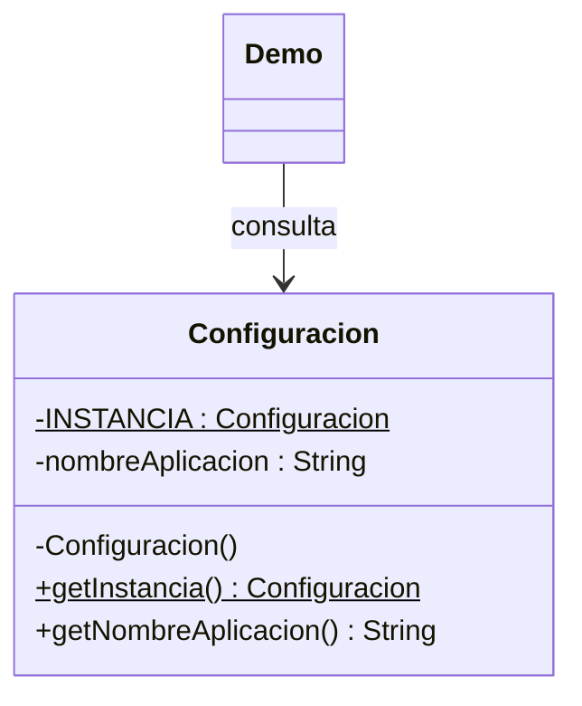

# Singleton

**Tipo:** Creacionales. **Ejemplo:** Configuración del campus virtual.

## Problema

Varios clientes necesitan acceder a una configuración común y se desea evitar que creen instancias diferentes.

## Solución

Configuracion tiene constructor privado y una instancia estática final. getInstancia() devuelve siempre esa referencia.

## Participantes y archivos

| Archivo o participante | Rol |
| --- | --- |
| `Configuracion` | Singleton inmutable |
| `Demo` | cliente que compara referencias |

Cada clase o interfaz propia está en un archivo Java con su mismo nombre. `Demo.java` organiza el ejemplo y sus comprobaciones; no es un participante esencial del patrón. Los contratos de la biblioteca estándar no se duplican.

## Diagrama UML

El diagrama resume las relaciones y operaciones relevantes del código; omite accesores que no ayudan a explicar el patrón.



## Consecuencias

- **Ventajas:** Centraliza el acceso y garantiza una instancia por cargador de clases.
- **Costos:** Introduce una dependencia global que puede complicar pruebas y ocultar acoplamiento. No resuelve por sí mismo la concurrencia del estado mutable.

## Ejecutar y comprobar

Desde la raíz del repo, compilar primero con `./verificar.ps1` o con las instrucciones del [README general](../../../../../../../README.md).

```powershell
java -ea -cp out com.patronesingsoft.creational.Singleton.Demo
```

**Qué se comprueba:** Identidad de dos consultas y valor de configuración.

La opción `-ea` habilita las aserciones. Si una condición falla, Java lanza `AssertionError` y la ejecución termina con error. Las validaciones de entradas del ejemplo funcionan también sin `-ea`.

## Guion breve para exponer

1. Presentar el problema del ejemplo.
2. Identificar los participantes en el UML y abrir sus archivos.
3. Ejecutar `Demo` y seguir las llamadas relevantes en el código comentado.
4. Explicar esta idea: El constructor privado restringe la creación; la inicialización estática crea la instancia. == verifica identidad, no solo igualdad de valores.
5. Cerrar con una ventaja y un costo de usar el patrón.

## Alcance del ejemplo

Una instancia por cargador de clases, no una instancia compartida entre procesos. El estado es inmutable.

## Referencia conceptual

[Refactoring.Guru — Singleton](https://refactoring.guru/es/design-patterns/singleton). La explicación y el UML corresponden a la implementación didáctica de este repositorio. No se copian los ejemplos de la fuente.
