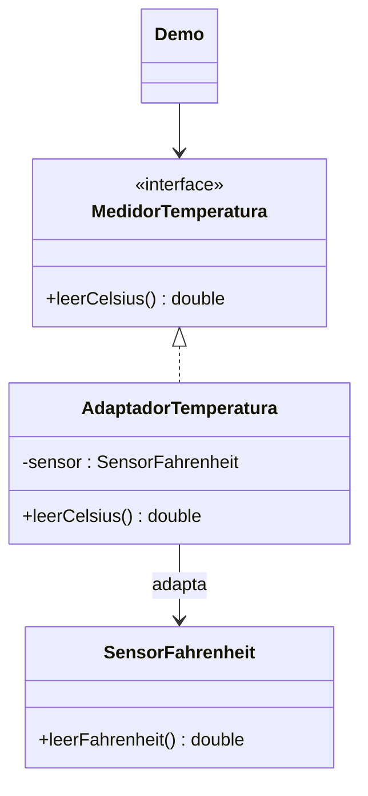

# Adapter

**Tipo:** Estructurales. **Ejemplo:** Sensor Fahrenheit consumido en Celsius.

## Problema

La aplicación espera leerCelsius(), pero el sensor existente ofrece leerFahrenheit(). Sus interfaces y unidades no coinciden.

## Solución

AdaptadorTemperatura implementa MedidorTemperatura y traduce la lectura del sensor a Celsius.

## Participantes y archivos

| Archivo o participante | Rol |
| --- | --- |
| `MedidorTemperatura` | interfaz objetivo |
| `SensorFahrenheit` | adaptado |
| `AdaptadorTemperatura` | adaptador por composición |
| `Demo` | cliente |

Cada clase o interfaz propia está en un archivo Java con su mismo nombre. `Demo.java` organiza el ejemplo y sus comprobaciones; no es un participante esencial del patrón. Los contratos de la biblioteca estándar no se duplican.

## Diagrama UML

El diagrama resume las relaciones y operaciones relevantes del código; omite accesores que no ayudan a explicar el patrón.



## Consecuencias

- **Ventajas:** Reutiliza el componente existente y concentra la conversión en un punto.
- **Costos:** Agrega una capa y debe traducir correctamente tanto operaciones como unidades y errores.

## Ejecutar y comprobar

Desde la raíz del repo, compilar primero con `./verificar.ps1` o con las instrucciones del [README general](../../../../../../../README.md).

```powershell
java -ea -cp out com.patronesingsoft.structural.Adapter.Demo
```

**Qué se comprueba:** 68 °F equivale a 20 °C y 32 °F a 0 °C.

La opción `-ea` habilita las aserciones. Si una condición falla, Java lanza `AssertionError` y la ejecución termina con error. Las validaciones de entradas del ejemplo funcionan también sin `-ea`.

## Guion breve para exponer

1. Presentar el problema del ejemplo.
2. Identificar los participantes en el UML y abrir sus archivos.
3. Ejecutar `Demo` y seguir las llamadas relevantes en el código comentado.
4. Explicar esta idea: El cliente conserva su interfaz; la traducción queda dentro del adaptador. Comparar con Bridge: aquí se integra un componente ya incompatible.
5. Cerrar con una ventaja y un costo de usar el patrón.

## Alcance del ejemplo

Lecturas fijas de un sensor simulado; no modela hardware ni calibración.

## Referencia conceptual

[Refactoring.Guru — Adapter](https://refactoring.guru/es/design-patterns/adapter). La explicación y el UML corresponden a la implementación didáctica de este repositorio. No se copian los ejemplos de la fuente.
