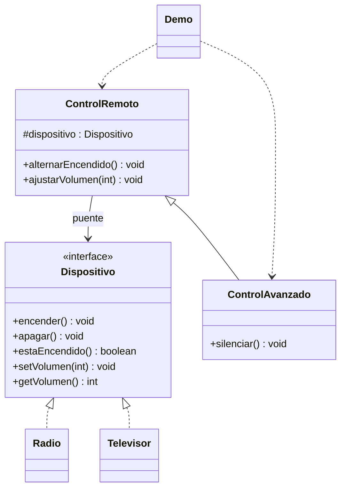

# Bridge

**Tipo:** Estructurales. **Ejemplo:** Controles remotos y dispositivos.

## Problema

Si se crea una clase por combinación de control y dispositivo, las variantes se multiplican al agregar controles o equipos.

## Solución

ControlRemoto contiene un Dispositivo. ControlAvanzado extiende funciones del control, mientras Radio y Televisor implementan el lado del dispositivo.

## Participantes y archivos

| Archivo o participante | Rol |
| --- | --- |
| `Dispositivo` | implementación abstracta |
| `Radio`, `Televisor` | implementaciones concretas |
| `ControlRemoto` | abstracción |
| `ControlAvanzado` | abstracción refinada |
| `Demo` | cliente |

Cada clase o interfaz propia está en un archivo Java con su mismo nombre. `Demo.java` organiza el ejemplo y sus comprobaciones; no es un participante esencial del patrón. Los contratos de la biblioteca estándar no se duplican.

## Diagrama UML

El diagrama resume las relaciones y operaciones relevantes del código; omite accesores que no ayudan a explicar el patrón.



## Consecuencias

- **Ventajas:** Las dos dimensiones pueden evolucionar y combinarse independientemente.
- **Costos:** Exige diseñar una interfaz de implementación estable e incorpora indirección.

## Ejecutar y comprobar

Desde la raíz del repo, compilar primero con `./verificar.ps1` o con las instrucciones del [README general](../../../../../../../README.md).

```powershell
java -ea -cp out com.patronesingsoft.structural.Bridge.Demo
```

**Qué se comprueba:** Encendido, apagado y volumen; combinación de ambos controles con ambos dispositivos.

La opción `-ea` habilita las aserciones. Si una condición falla, Java lanza `AssertionError` y la ejecución termina con error. Las validaciones de entradas del ejemplo funcionan también sin `-ea`.

## Guion breve para exponer

1. Presentar el problema del ejemplo.
2. Identificar los participantes en el UML y abrir sus archivos.
3. Ejecutar `Demo` y seguir las llamadas relevantes en el código comentado.
4. Explicar esta idea: Mostrar las dos jerarquías: controles y dispositivos. El puente es la referencia a Dispositivo, no la herencia entre controles.
5. Cerrar con una ventaja y un costo de usar el patrón.

## Alcance del ejemplo

Estado de dispositivos simulado en memoria.

## Referencia conceptual

[Refactoring.Guru — Bridge](https://refactoring.guru/es/design-patterns/bridge). La explicación y el UML corresponden a la implementación didáctica de este repositorio. No se copian los ejemplos de la fuente.
