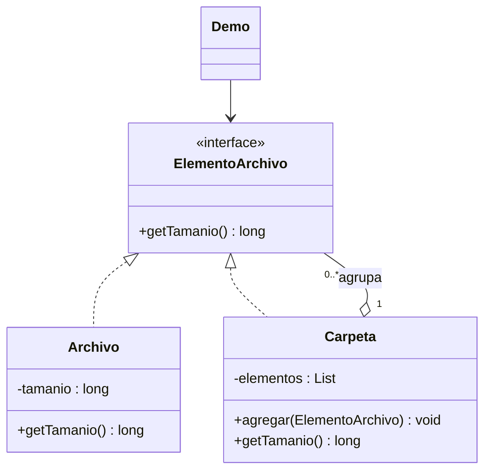

# Composite

**Tipo:** Estructurales. **Ejemplo:** Tamaño de archivos y carpetas.

## Problema

Calcular el tamaño de una jerarquía puede obligar al cliente a distinguir archivos, carpetas y subcarpetas en cada nivel.

## Solución

Archivo y Carpeta implementan ElementoArchivo. Carpeta suma recursivamente el tamaño de sus componentes mediante el mismo contrato.

## Participantes y archivos

| Archivo o participante | Rol |
| --- | --- |
| `ElementoArchivo` | componente |
| `Archivo` | hoja |
| `Carpeta` | compuesto |
| `Demo` | cliente |

Cada clase o interfaz propia está en un archivo Java con su mismo nombre. `Demo.java` organiza el ejemplo y sus comprobaciones; no es un participante esencial del patrón. Los contratos de la biblioteca estándar no se duplican.

## Diagrama UML

El diagrama resume las relaciones y operaciones relevantes del código; omite accesores que no ayudan a explicar el patrón.



## Consecuencias

- **Ventajas:** Permite tratar uniformemente hojas y conjuntos y construir jerarquías recursivas.
- **Costos:** Una interfaz común puede no encajar con todas las operaciones; también hay que controlar ciclos y definir cómo tratar elementos compartidos.

## Ejecutar y comprobar

Desde la raíz del repo, compilar primero con `./verificar.ps1` o con las instrucciones del [README general](../../../../../../../README.md).

```powershell
java -ea -cp out com.patronesingsoft.structural.Composite.Demo
```

**Qué se comprueba:** Carpeta vacía, suma de hojas, suma anidada y rechazo de un ciclo indirecto.

La opción `-ea` habilita las aserciones. Si una condición falla, Java lanza `AssertionError` y la ejecución termina con error. Las validaciones de entradas del ejemplo funcionan también sin `-ea`.

## Guion breve para exponer

1. Presentar el problema del ejemplo.
2. Identificar los participantes en el UML y abrir sus archivos.
3. Ejecutar `Demo` y seguir las llamadas relevantes en el código comentado.
4. Explicar esta idea: Carpeta llama getTamanio() sin preguntar qué clase tiene cada hijo. Cada referencia agregada participa en la suma.
5. Cerrar con una ventaja y un costo de usar el patrón.

## Alcance del ejemplo

Jerarquía en memoria y sin ciclos. Se permite compartir elementos; una referencia repetida se cuenta nuevamente. La búsqueda preventiva de ciclos recorre subcarpetas.

## Referencia conceptual

[Refactoring.Guru — Composite](https://refactoring.guru/es/design-patterns/composite). La explicación y el UML corresponden a la implementación didáctica de este repositorio. No se copian los ejemplos de la fuente.
