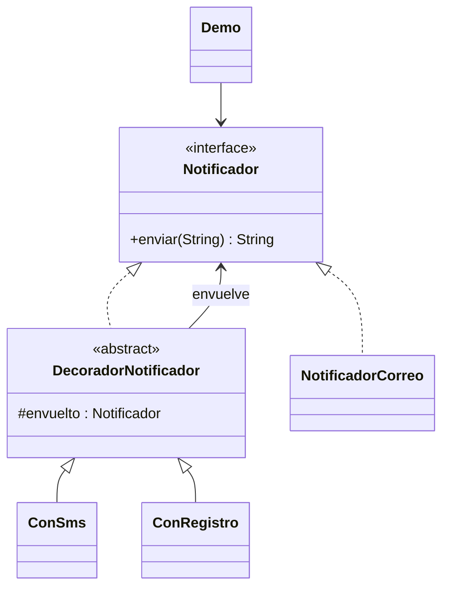

# Decorator

**Tipo:** Estructurales. **Ejemplo:** Correo con SMS y registro.

## Problema

Se necesitan combinaciones de funciones de notificación sin crear una subclase distinta por cada combinación.

## Solución

Los decoradores implementan Notificador y envuelven otro Notificador. Cada uno delega el envío y agrega una función.

## Participantes y archivos

| Archivo o participante | Rol |
| --- | --- |
| `Notificador` | componente |
| `NotificadorCorreo` | componente concreto |
| `DecoradorNotificador` | decorador base |
| `ConSms`, `ConRegistro` | decoradores concretos |
| `Demo` | cliente |

Cada clase o interfaz propia está en un archivo Java con su mismo nombre. `Demo.java` organiza el ejemplo y sus comprobaciones; no es un participante esencial del patrón. Los contratos de la biblioteca estándar no se duplican.

## Diagrama UML

El diagrama resume las relaciones y operaciones relevantes del código; omite accesores que no ayudan a explicar el patrón.



## Consecuencias

- **Ventajas:** Permite combinar comportamientos en ejecución y mantener responsabilidades pequeñas.
- **Costos:** El orden de envoltura puede afectar el resultado y una cadena larga dificulta depurar o identificar el objeto base.

## Ejecutar y comprobar

Desde la raíz del repo, compilar primero con `./verificar.ps1` o con las instrucciones del [README general](../../../../../../../README.md).

```powershell
java -ea -cp out com.patronesingsoft.structural.Decorator.Demo
```

**Qué se comprueba:** Envío base y suma de dos decoradores conservando el comportamiento previo.

La opción `-ea` habilita las aserciones. Si una condición falla, Java lanza `AssertionError` y la ejecución termina con error. Las validaciones de entradas del ejemplo funcionan también sin `-ea`.

## Guion breve para exponer

1. Presentar el problema del ejemplo.
2. Identificar los participantes en el UML y abrir sus archivos.
3. Ejecutar `Demo` y seguir las llamadas relevantes en el código comentado.
4. Explicar esta idea: Leer la construcción desde adentro hacia afuera. A diferencia de Proxy, la intención aquí es sumar responsabilidades.
5. Cerrar con una ventaja y un costo de usar el patrón.

## Alcance del ejemplo

Los canales y el registro son textos de demostración, sin efectos externos.

## Referencia conceptual

[Refactoring.Guru — Decorator](https://refactoring.guru/es/design-patterns/decorator). La explicación y el UML corresponden a la implementación didáctica de este repositorio. No se copian los ejemplos de la fuente.
