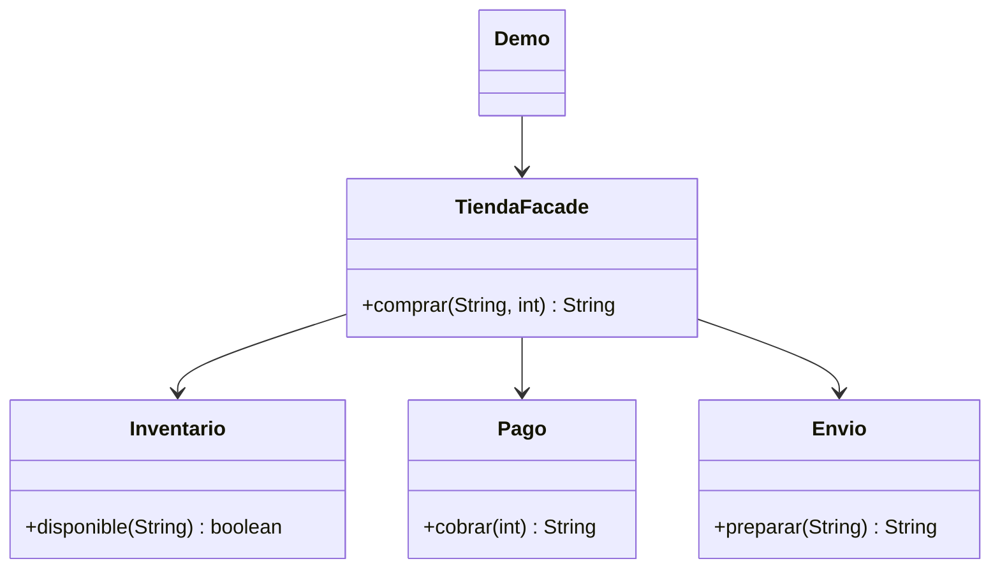

# Facade

**Tipo:** Estructurales. **Ejemplo:** Compra con inventario, pago y envío.

## Problema

El cliente debe conocer varios subsistemas y coordinar sus llamadas para realizar una compra.

## Solución

TiendaFacade ofrece comprar() y coordina Inventario, Pago y Envio detrás de una operación simple.

## Participantes y archivos

| Archivo o participante | Rol |
| --- | --- |
| `TiendaFacade` | fachada |
| `Inventario`, `Pago`, `Envio` | subsistemas |
| `Demo` | cliente |

Cada clase o interfaz propia está en un archivo Java con su mismo nombre. `Demo.java` organiza el ejemplo y sus comprobaciones; no es un participante esencial del patrón. Los contratos de la biblioteca estándar no se duplican.

## Diagrama UML

El diagrama resume las relaciones y operaciones relevantes del código; omite accesores que no ayudan a explicar el patrón.



## Consecuencias

- **Ventajas:** Reduce el conocimiento del cliente sobre el subsistema y concentra el flujo habitual.
- **Costos:** La fachada puede acumular demasiadas responsabilidades y no elimina la necesidad de transacciones o compensaciones en un sistema real.

## Ejecutar y comprobar

Desde la raíz del repo, compilar primero con `./verificar.ps1` o con las instrucciones del [README general](../../../../../../../README.md).

```powershell
java -ea -cp out com.patronesingsoft.structural.Facade.Demo
```

**Qué se comprueba:** Compra completa, ausencia de stock e importe inválido.

La opción `-ea` habilita las aserciones. Si una condición falla, Java lanza `AssertionError` y la ejecución termina con error. Las validaciones de entradas del ejemplo funcionan también sin `-ea`.

## Guion breve para exponer

1. Presentar el problema del ejemplo.
2. Identificar los participantes en el UML y abrir sus archivos.
3. Ejecutar `Demo` y seguir las llamadas relevantes en el código comentado.
4. Explicar esta idea: Mostrar una llamada comprar() y luego sus tres pasos. La fachada simplifica el acceso, pero el subsistema sigue existiendo.
5. Cerrar con una ventaja y un costo de usar el patrón.

## Alcance del ejemplo

Todo es simulado y no modifica inventario ni mueve dinero. Importes enteros en centavos; no representa una transacción comercial real.

## Referencia conceptual

[Refactoring.Guru — Facade](https://refactoring.guru/es/design-patterns/facade). La explicación y el UML corresponden a la implementación didáctica de este repositorio. No se copian los ejemplos de la fuente.
