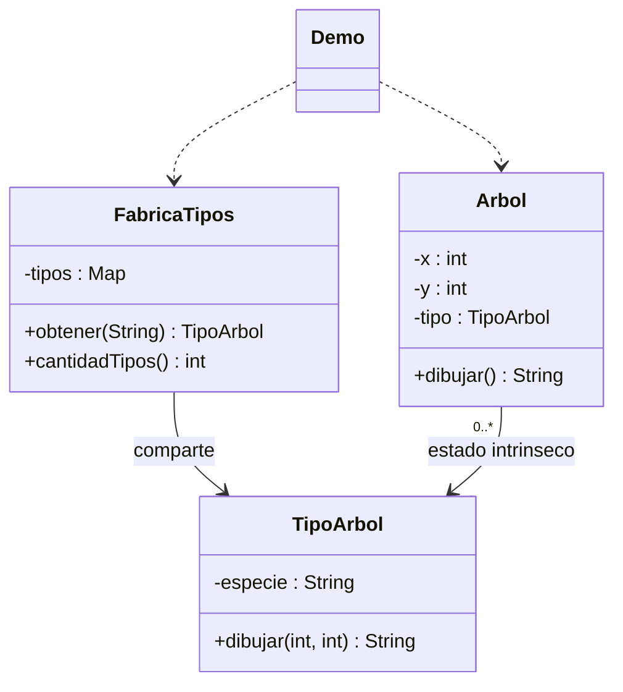

# Flyweight

**Tipo:** Estructurales. **Ejemplo:** Árboles que comparten su especie.

## Problema

Muchos árboles repiten la descripción de su especie aunque cada uno tiene una posición propia.

## Solución

TipoArbol guarda el estado intrínseco inmutable. FabricaTipos comparte un tipo por especie y Arbol conserva las coordenadas extrínsecas.

## Participantes y archivos

| Archivo o participante | Rol |
| --- | --- |
| `TipoArbol` | flyweight |
| `FabricaTipos` | fábrica y caché |
| `Arbol` | contexto con estado extrínseco |
| `Demo` | cliente |

Cada clase o interfaz propia está en un archivo Java con su mismo nombre. `Demo.java` organiza el ejemplo y sus comprobaciones; no es un participante esencial del patrón. Los contratos de la biblioteca estándar no se duplican.

## Diagrama UML

El diagrama resume las relaciones y operaciones relevantes del código; omite accesores que no ayudan a explicar el patrón.



## Consecuencias

- **Ventajas:** Reduce la duplicación cuando muchos objetos comparten una parte importante de su estado.
- **Costos:** Separar ambos tipos de estado aumenta la complejidad; la caché necesita una política de tamaño y concurrencia si crece.

## Ejecutar y comprobar

Desde la raíz del repo, compilar primero con `./verificar.ps1` o con las instrucciones del [README general](../../../../../../../README.md).

```powershell
java -ea -cp out com.patronesingsoft.structural.Flyweight.Demo
```

**Qué se comprueba:** Identidad del tipo compartido, separación entre especies y conservación de coordenadas propias.

La opción `-ea` habilita las aserciones. Si una condición falla, Java lanza `AssertionError` y la ejecución termina con error. Las validaciones de entradas del ejemplo funcionan también sin `-ea`.

## Guion breve para exponer

1. Presentar el problema del ejemplo.
2. Identificar los participantes en el UML y abrir sus archivos.
3. Ejecutar `Demo` y seguir las llamadas relevantes en el código comentado.
4. Explicar esta idea: La especie es compartida; x e y no lo son. Flyweight comparte una parte del estado, no obliga a compartir el objeto Arbol completo.
5. Cerrar con una ventaja y un costo de usar el patrón.

## Alcance del ejemplo

Caché de un hilo y sin límite automático; se usa con dos especies. La demo comprueba identidad, no mide ahorro de memoria.

## Referencia conceptual

[Refactoring.Guru — Flyweight](https://refactoring.guru/es/design-patterns/flyweight). La explicación y el UML corresponden a la implementación didáctica de este repositorio. No se copian los ejemplos de la fuente.
