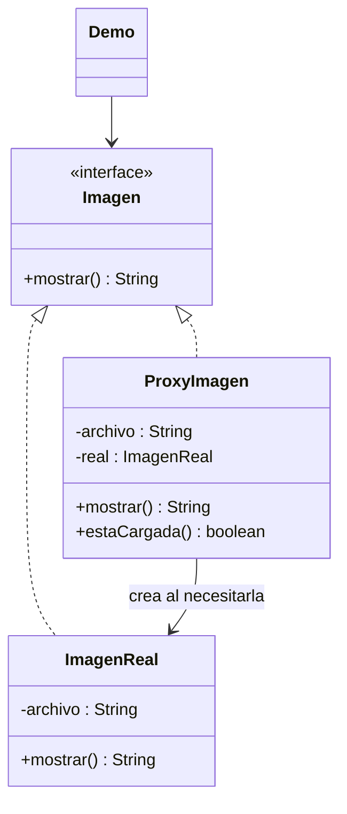

# Proxy

**Tipo:** Estructurales. **Ejemplo:** Carga diferida de una imagen.

## Problema

Una imagen puede ser costosa de cargar y no conviene hacerlo antes de saber si se utilizará.

## Solución

ProxyImagen implementa Imagen y crea ImagenReal en la primera llamada a mostrar(). Las siguientes llamadas reutilizan el objeto real.

## Participantes y archivos

| Archivo o participante | Rol |
| --- | --- |
| `Imagen` | sujeto abstracto |
| `ImagenReal` | sujeto real |
| `ProxyImagen` | proxy virtual |
| `Demo` | cliente |

Cada clase o interfaz propia está en un archivo Java con su mismo nombre. `Demo.java` organiza el ejemplo y sus comprobaciones; no es un participante esencial del patrón. Los contratos de la biblioteca estándar no se duplican.

## Diagrama UML

El diagrama resume las relaciones y operaciones relevantes del código; omite accesores que no ayudan a explicar el patrón.



## Consecuencias

- **Ventajas:** Controla el acceso y evita trabajo hasta que es necesario.
- **Costos:** Agrega indirección; la inicialización diferida necesita coordinación si varios hilos comparten el proxy.

## Ejecutar y comprobar

Desde la raíz del repo, compilar primero con `./verificar.ps1` o con las instrucciones del [README general](../../../../../../../README.md).

```powershell
java -ea -cp out com.patronesingsoft.structural.Proxy.Demo
```

**Qué se comprueba:** Sin carga antes del uso, carga al primer acceso y resultado de accesos repetidos.

La opción `-ea` habilita las aserciones. Si una condición falla, Java lanza `AssertionError` y la ejecución termina con error. Las validaciones de entradas del ejemplo funcionan también sin `-ea`.

## Guion breve para exponer

1. Presentar el problema del ejemplo.
2. Identificar los participantes en el UML y abrir sus archivos.
3. Ejecutar `Demo` y seguir las llamadas relevantes en el código comentado.
4. Explicar esta idea: La línea Cargando imagen aparece una sola vez. El cliente usa la misma interfaz para el representante y el objeto real.
5. Cerrar con una ventaja y un costo de usar el patrón.

## Alcance del ejemplo

Proxy virtual de un hilo y carga simulada; no lee archivos ni implementa permisos.

## Referencia conceptual

[Refactoring.Guru — Proxy](https://refactoring.guru/es/design-patterns/proxy). La explicación y el UML corresponden a la implementación didáctica de este repositorio. No se copian los ejemplos de la fuente.
